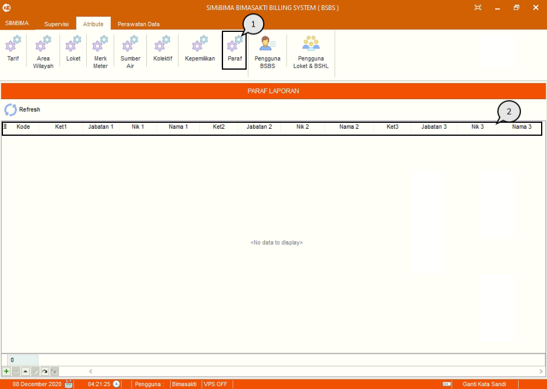

= Menambah, Mengubah, dan Menghapus Data Paraf

Fitur ini berfungsi untuk mengelola data paraf, baik itu menambahkan dan memperbarui data seperti langkah berikut.

1. Pilih menu *Atribut*, cari ikon *Paraf*
2. Masukkan data sesuai dengan kolom yang tersedia.
