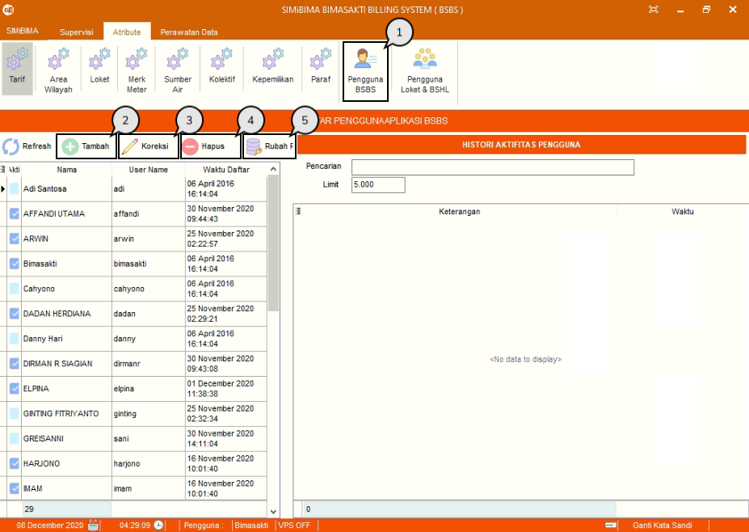
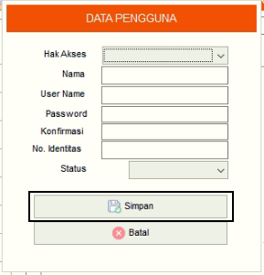
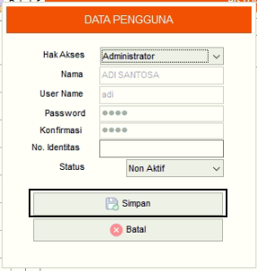
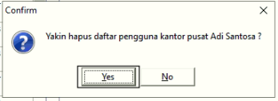
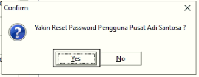

= Menambah, Mengubah, dan Menghapus Data Pengguna BSBS

Fitur ini berfungsi untuk mengelola data pengguna aplikasi BSBS baik itu menambahkan, memperbarui, menghapus data maupun mengubah _password_ seperti langkah berikut.

1. Pilih menu *Atribut*, cari ikon *Pengguna BSBS*
2. Tekan ikon *Tambah* seperti poin 2 pada gambar di atas untuk menambahkan data Pengguna BSBS. Selanjutnya, isi _form_ data Pengguna BSBS. Jika sudah, tekan tombol *Simpan* seperti gambar di bawah ini
+

3. Pilih data yang ingin diubah terlebih dahulu. Tekan ikon *Koreksi*, lalu perbarui bagian yang ingin diubah. Jika sudah, tekan tombol *Simpan* seperti gambar di bawah ini
+

4. Pilih data yang ingin dihapus terlebih dahulu. Tekan ikon *Hapus* dan akan muncul _pop-up_ konfirmasi. Jika sudah yakin untuk menghapus data, tekan tombol *Yes*
+

5. Pilih data yang ingin kamu _reset password_-nya. Selanjutnya tekan ikon *_Reset Password_* dan akan muncul _pop-up_ konfirmasi. Jika sudah yakin, tekan tombol *Yes*.
+

