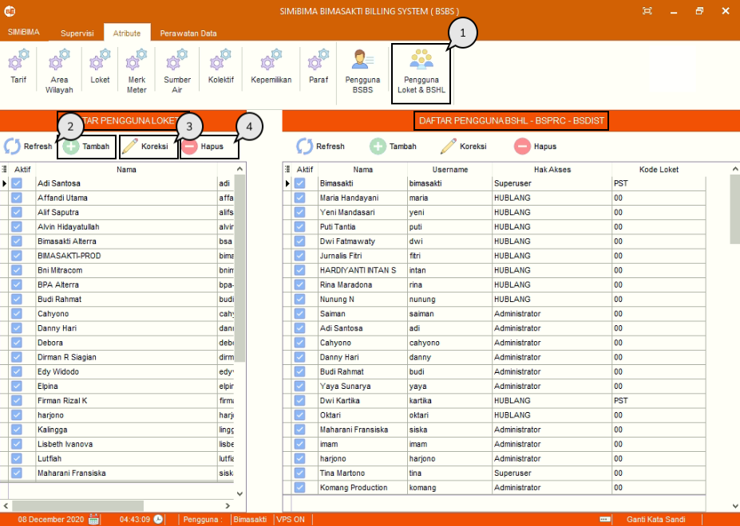
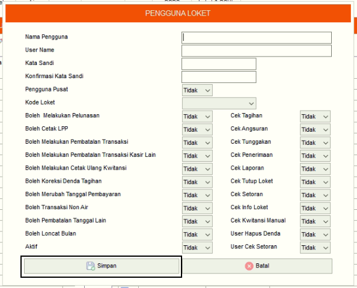
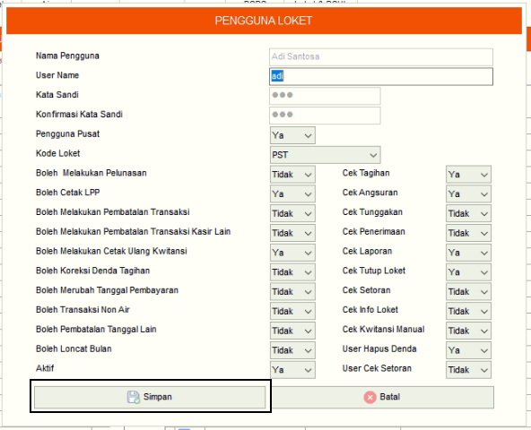
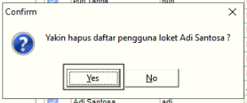

= Menambah, Mengubah, dan Menghapus Data Pengguna Loket, dan BSHL

Fitur ini berfungsi untuk mengelola data pengguna aplikasi Loket & BSHL, baik itu menambahkan, memperbarui maupun menghapus data. Jika ingin mengelola *Pengguna Loket*, berada pada kolom kiri. Sedangkan untuk *Pengguna BSHL* ada di kolom kanan seperti penjelasan di bawah ini.

1. Pilih menu *Atribut*, cari ikon *Pengguna Loket & BSHL*. Contoh yang digunakan adalah manajemen *Pengguna Loket*
2. Tekan ikon *Tambah* seperti poin 2 pada gambar di atas. Isi _form_ data Pengguna Loket. Jika sudah, tekan tombol *Simpan*
+

3. Pilih data yang ingin diubah terlebih dahulu. Tekan ikon *Koreksi*, lalu perbarui bagian yang ingin diubah. Jika sudah, tekan tombol *Simpan*
+

4. Pilih data yang ingin dihapus terlebih dahulu. Tekan ikon *Hapus* sampai muncul _pop-up_ konfirmasi. Jika sudah yakin, tekan tombol *Yes*.
+

