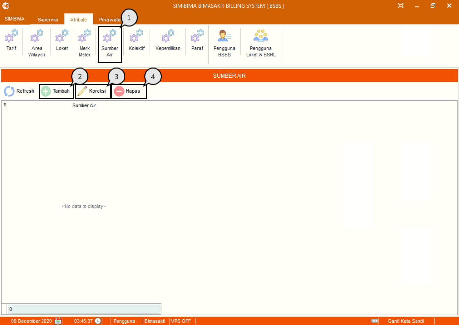
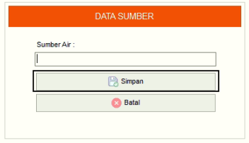

= Menambah, Mengubah, dan Menghapus Data Sumber Air

Fitur ini berfungsi untuk mengelola data sumber air, baik itu menambahkan, memperbarui maupun menghapus data seperti langkah berikut.

1. Pilih menu *Atribut*, cari ikon *Sumber Air*
2. Tekan ikon *tambah* seperti poin 3 pada gambar di atas untuk menambahkan data sumber air. Selanjutnya isi _form_ data sumber air, dan tekan tombol *Simpan* seperti gambar di bawah ini :
+

3. Pilih data yang ingin diubah terlebih dahulu. Selanjutnya tekan ikon *Koreksi*, dan perbarui bagian yang ingin diubah. Jika sudah, tekan tombol *Simpan*
4. Pilih data yang ingin dihapus terlebih dahulu. Selanjutnya tekan ikon *Hapus* dan akan muncul _form_ konfirmasi. Jika sudah yakin untuk menghapus data sumber air, tekan tombol *Yes*.
