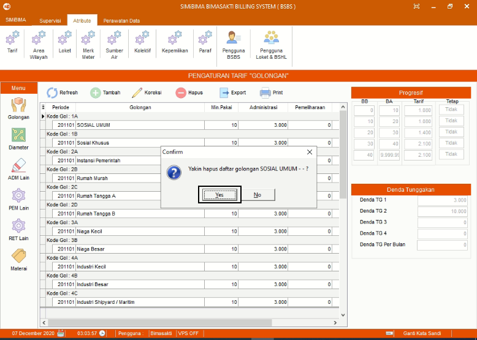

= Menambah, Mengubah, dan Menghapus Data Tarif

Fitur ini berfungsi untuk mengelola tarif, baik itu menambahkan, memperbarui maupun menghapus data seperti langkah di bawah ini.

1. Pilih menu *Atribut*
2. Cari ikon *Tarif*
3. Pilih jenis pengaturan tarif yang ingin di proses, baik itu tarif Golongan, Diameter, ADM Lain, PEM Lain, RET Lain, Material, atau RAB seperti poin 3 pada gambar di atas
4. Contoh yang ditunjukkan yaitu:
+
a. *Pengaturan Tarif Golongan*
+

[number]
.. Untuk menambahkan data tarif golongan tekan ikon *Tambah* seperti poin 4 pada gambar di atas. Selanjutnya isi _form_ data tarif golongan. Jika sudah, tekan tombol *Simpan* seperti gambar di bawah ini
+

.. Pilih data yang ingin diubah terlebih dahulu. Selanjutnya tekan ikon *Koreksi* seperti poin 5 pada gambar di atas untuk memperbarui. Tekan tombol *Simpan* seperti gambar di bawah ini
+

.. Pilih data yang ingin dihapus terlebih dahulu. Selanjutnya tekan ikon *Hapus* seperti poin 6 pada gambar di atas, lalu akan muncul _pop-up_ konfirmasi seperti gambar di bawah ini. Tekan tombol *Yes* jika sudah yakin untuk menghapus data.
+

b. *Pengaturan Tarif Materai*
+

[number]
.. Untuk menambahkan tarif materai yang dikenakan kepada pelanggan sesuai dengan periode tertentu, masukkan *Id Materai* baru pada poin 1
.. Kemudian masukkan batas nominal untuk menentukan biaya materai yang akan dikenakan pada kolom *Batas Nominal (Rp.)*
.. Masukkan nominal materai pada kolom *Materai (Rp.)*
.. Masukkan periode awal berlakunya tarif materai pada kolom *P.Awal(YYYYMM)*
.. Pada kolom *P.Akhir(YYYYMM)* masukkan periode terakhir tarif materai berlaku
.. Kemudian tekan tombol *Simpan*.
