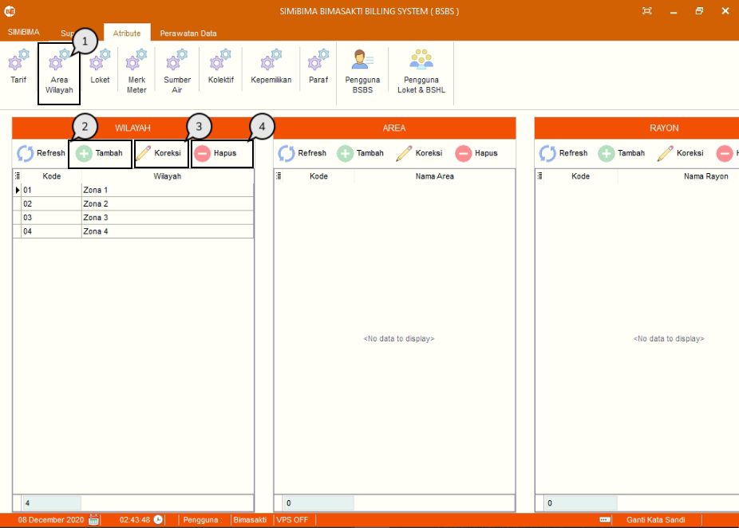
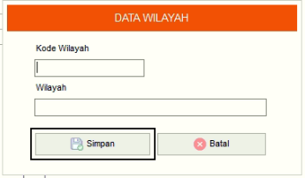
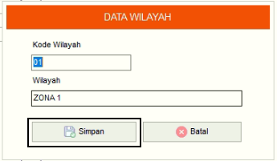
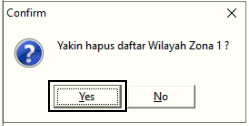

= Menambah, Mengubah, dan Menghapus Data Wilayah

Fitur ini berfungsi untuk mengelola data wilayah, baik itu menambahkan, memperbarui maupun menghapus data seperti langkah di bawah ini.

1. Pilih menu *Atribut*, cari ikon *Area Wilayah*
2. Tekan ikon *Tambah* seperti poin 3 pada gambar di atas untuk menambahkan data wilayah, area, atau rayon. Contoh yang digunakan yaitu penambahan data wilayah. Selanjutnya isi _form_ data wilayah. Tekan tombol *Simpan* setelah menambah data seperti gambar di bawah ini
+

3. Pilih data yang ingin diubah terlebih dahulu. Selanjutnya, tekan ikon *Koreksi* seperti poin 4 pada gambar utama di atas, lalu perbarui bagian yang ingin diubah. Setelah selesai mengubah data, tekan tombol *Simpan* seperti gambar di bawah ini
+

4. Pilih data yang ingin dihapus terlebih dahulu. Lalu tekan ikon *Hapus*. Lalu akan muncul popup untuk konfirmasi menghapus data. Tekan tombol Yes seperti gambar di bawah ini.
+

