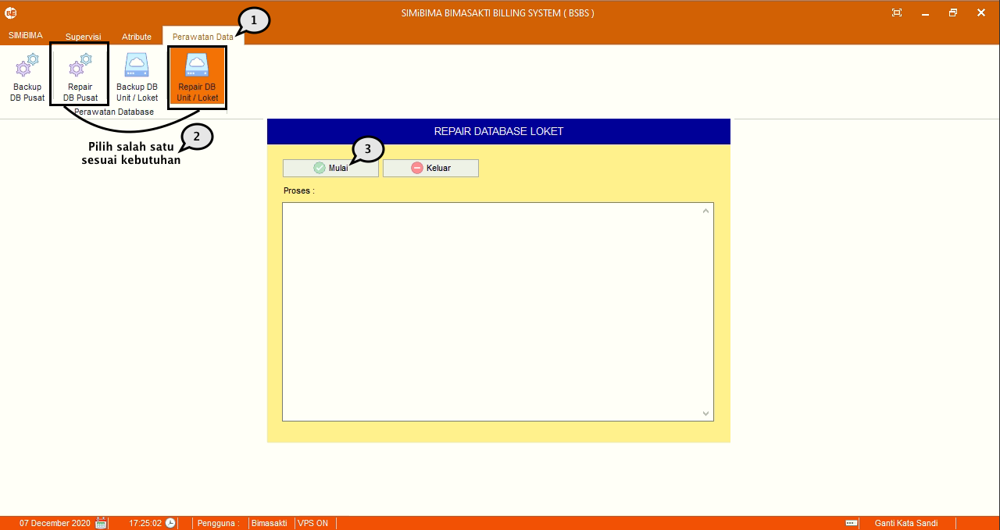

= Memperbaiki Database

*_Repair DB_* digunakan untuk memperbaiki _database_ BSBS dengan cara mengikuti langkah di bawah ini.

1. Pilih menu *Perbaikan data*
2. Selanjutnya pilih ikon *_Repair_ DB Pusat* untuk memperbaiki data PDAM pusat, atau *_Repair_ DB Unit* untuk memperbaiki data unit
3. Tekan tombol *Mulai*, tunggu hingga proses sukses.
