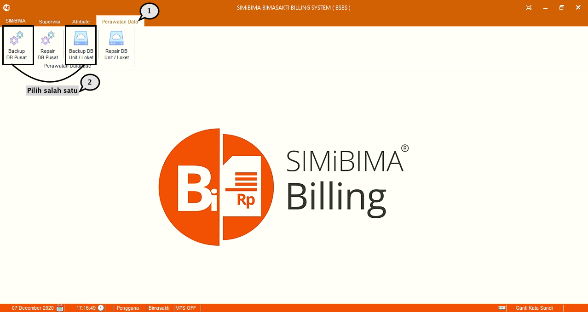
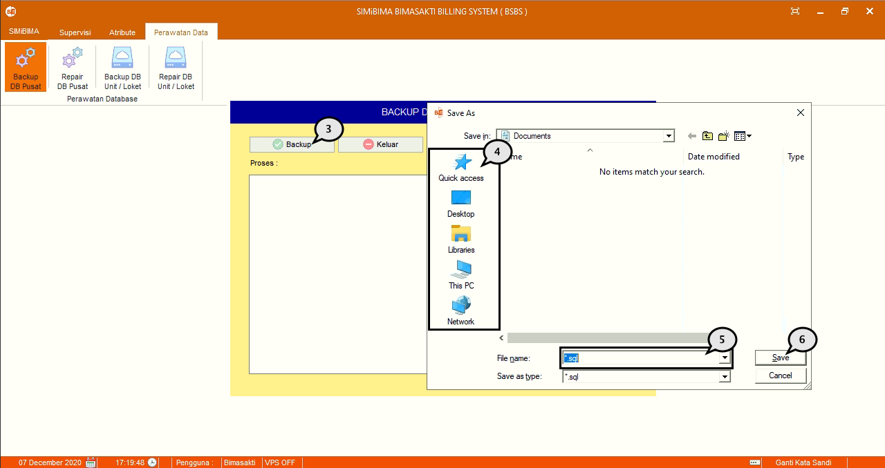

= Mencadangkan (Backup) Database

*_Backup DB_* digunakan untuk mencadangkan _database_ BSBS dengan mengikuti langkah di bawah ini.

1. Pilih menu *Perbaikan data*
2. Selanjutnya pilih ikon *_Backup DB_* pusat untuk membuat data cadangan PDAM pusat atau ikon *_Backup DB Unit_* untuk membuat data cadangan unit
+

3. Tekan tombol *_Backup_* 
4. Pilih lokasi penyimpanan data cadangan yang ingin dibuat
5. Beri nama data cadangan
6. Jika sudah, tekan tombol *Ok* untuk melakukan _backup database_.
