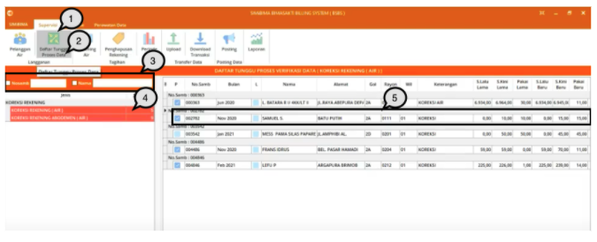
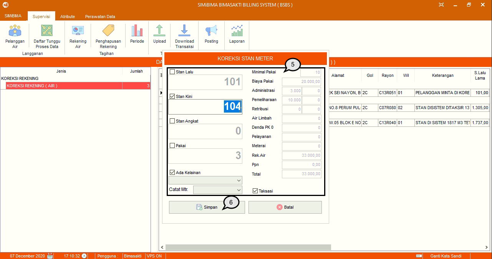
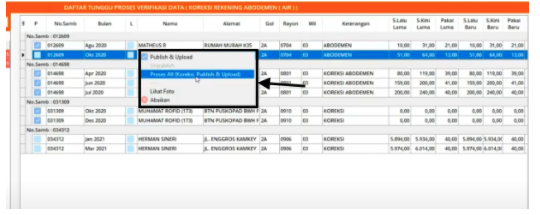

= Daftar Tunggu Proses Verifikasi Data (Koreksi Rekening Air)

Fitur ini berfungsi untuk melakukan verifikasi proses koreksi rekening. Untuk melakukannya, silakan mengikuti langkah-langkah berikut:

1. Pilih menu *Supervisi*
2. Cari ikon *Daftar Tunggu Proses Data*
3. Gunakan filter untuk mencari data pelanggan berdasarkan *Nomor Sambungan* dan *Nama*
4. Selanjutnya pilih jenis proses *Koreksi Rekening Air* dengan cara menekan tombol kiri pada mouse sebanyak dua kali
5. Setelah menekan klik dua kali _mouse_ pada proses koreksi rekening, data rekening yang perlu diproses akan ditampilkan pada tabel. Untuk memproses data yang diinginkan, klik dua kali pada data
+

6. Selanjutnya akan muncul _form_ update seperti poin 5 pada gambar di atas. Update _form_ sesuai kebutuhan
7. Klik pada tombol *Save* untuk menyimpan perubahan.

*Klik Kanan Action*

Klik kanan action bisa dilakukan dengan cara melakukan klik kanan pada list data *Daftar Tunggu Proses* :

Terdapat 5 Fitur dalam action Klik Kanan, yaitu : 

1. *Publish & Upload* : digunakan untuk melakukan publish dan upload pada data rekening yang dipilih

2. *Unpublish* : digunakan untuk membatalkan publish pada data rekening yang dipilih

3. *Proses All (Koreksi, Publish & Upload)* : Untuk melakukan koreksi hanya abonemen pada data

4. *Lihat Foto* : digunakan untuk melihat tampilan foto pada data yang dipilih

5. *Abaikan* : digunakan untuk mengabaikan koreksi rekening