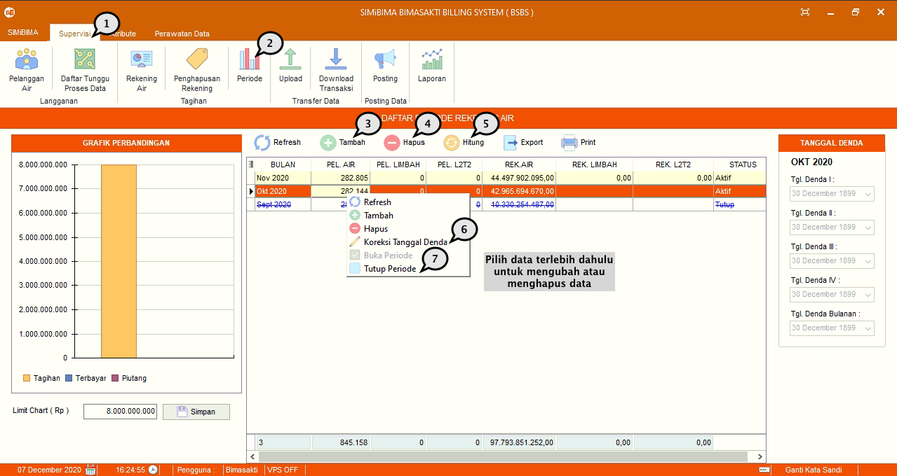
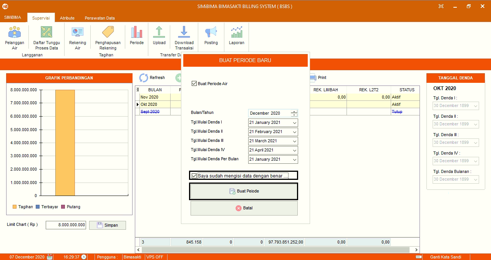
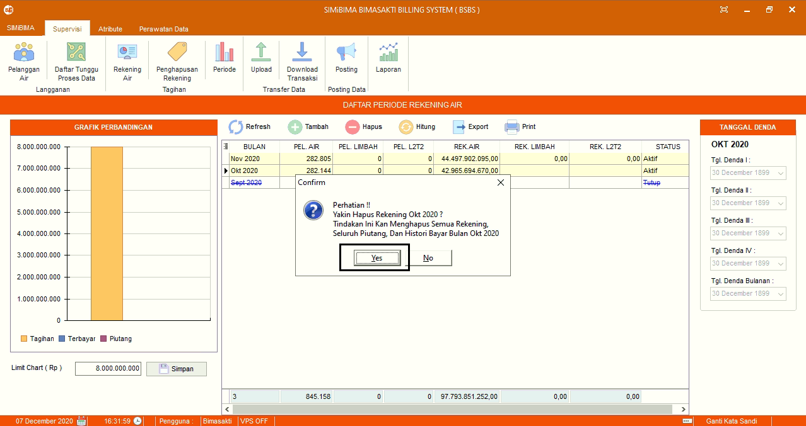
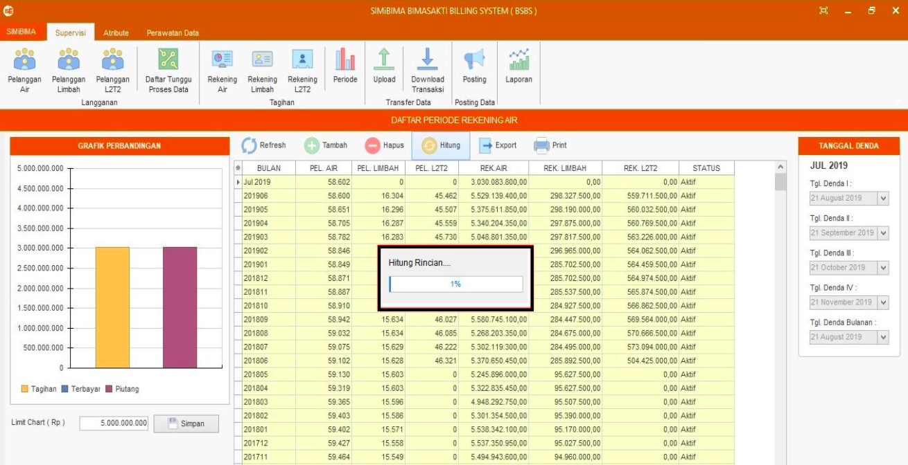
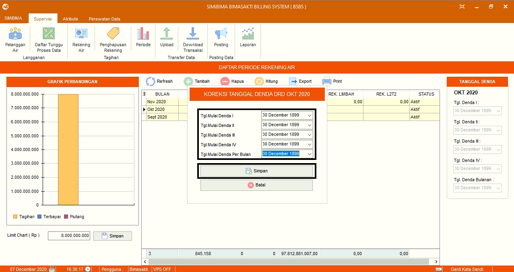
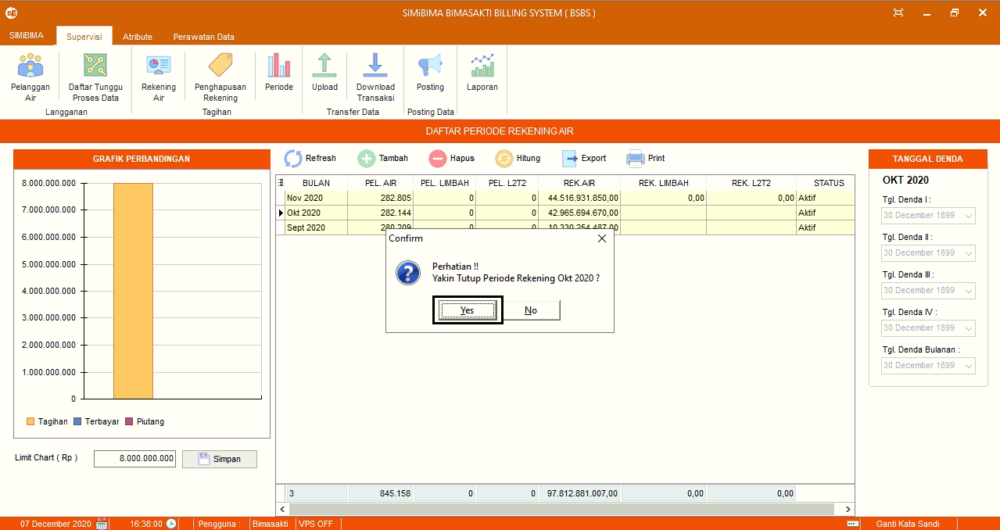

= Membuat, Mengubah, Menghapus, dan Menutup Data Periode

Fitur ini berfungsi untuk mengelola data data periode, baik itu membuat, memperbarui, menghapus, hitung, dan tutup periode. Berikut adalah langkah-langkahnya.

1. Pilih menu *Supervisi*
2. Cari ikon *Periode*
3. Untuk menambahkan periode baru tekan ikon *Tambah* seperti poin 3 pada gambar di atas. Selanjutnya isi _form_ *Buat Periode Baru*. Jika sudah, tekan tombol *Buat Periode* seperti gambar di bawah ini
+

4. Untuk menghapus data, pilih data yang ingin dihapus terlebih dahulu. Tekan ikon *Hapus*, seperti pada poin 4 pada gambar utama di atas. Selanjutnya terdapat _form_ konfirmasi, jika sudah yakin untuk menghapus data semua rekening, tekan tombol *Yes* seperti gambar di bawah ini
+

5. Untuk menghitung ulang, tekan ikon *Hitung Ulang* seperti pada poin 5 pada gambar utama di atas. Selanjutnya tunggu proses hitung ulang sampai selesai seperti gambar di bawah ini
+

6. Untuk memperbarui tanggal denda, pilih data yang ingin diubah terlebih dahulu. Selanjutnya klik kanan pada _mouse_, cari ikon *Koreksi Tanggal Denda*, seperti pada poin 6 pada gambar utama di atas. Lalu perbarui bagian yang ingin diubah. Jika sudah, tekan tombol *Simpan* seperti gambar di bawah ini
+

7. Untuk menutup periode, pilih periode data yang ingin ditutup terlebih dahulu. Selanjutnya klik kanan pada _mouse_, cari ikon *Tutup Periode*, seperti pada poin 7 pada gambar utama di atas. Selanjutnya terdapat _form_ konfirmasi, jika sudah yakin untuk menutup periode rekening, tekan tombol *Yes* seperti gambar di bawah ini
+

