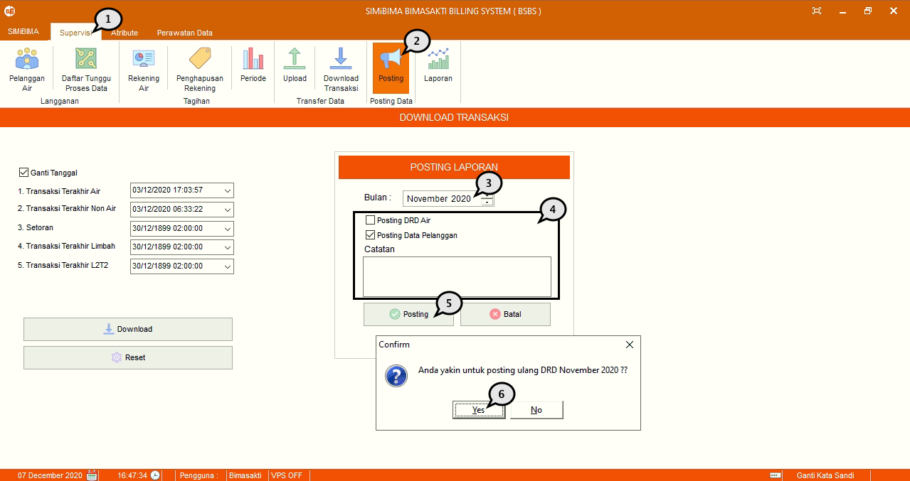

= Memposting Laporan Data Transaksi

Berikut adalah langkah-langkah untuk melakukan posting laporan transaksi :

1. Pilih menu *Supervisi*
2. Klik pada sub-menu *_Posting_*
3. Pilih periode bulan laporan yang ingin diunggah
4. Pilih data yang akan diunggah
5. Tekan tombol *_Posting_*
6. Selanjutnya terdapat _form_ konfirmasi, jika sudah yakin, tekan tombol *Yes*, seperti pada poin 6 pada gambar di atas. Tunggu hingga proses _posting_ sukses.
