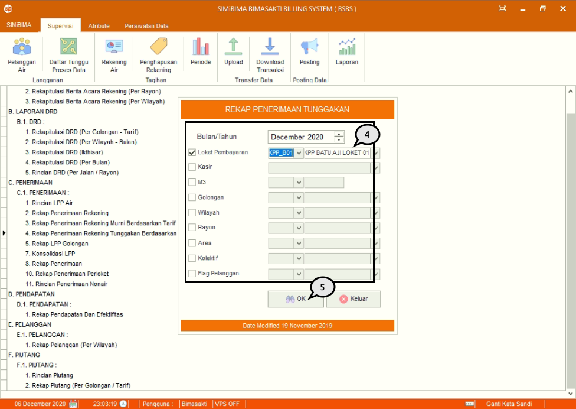

= Menampilkan Laporan dalam Modul Billing

Terdapat berbagai macam laporan dalam Modul Billing, untuk menampilkannya ikuti langkah-langkah di bawah ini.

1. Pilih menu *Supervisi*
2. Cari ikon *Laporan*
3. Pilih *jenis laporan* yang ingin ditampilkan, seperti poin 3 pada gambar di atas
+

4. Pilih filter *Laporan* yang ingin ditampilkan
5. Jika sudah, tekan tombol *OK*, selanjutnya tunggu hingga proses selesai.
