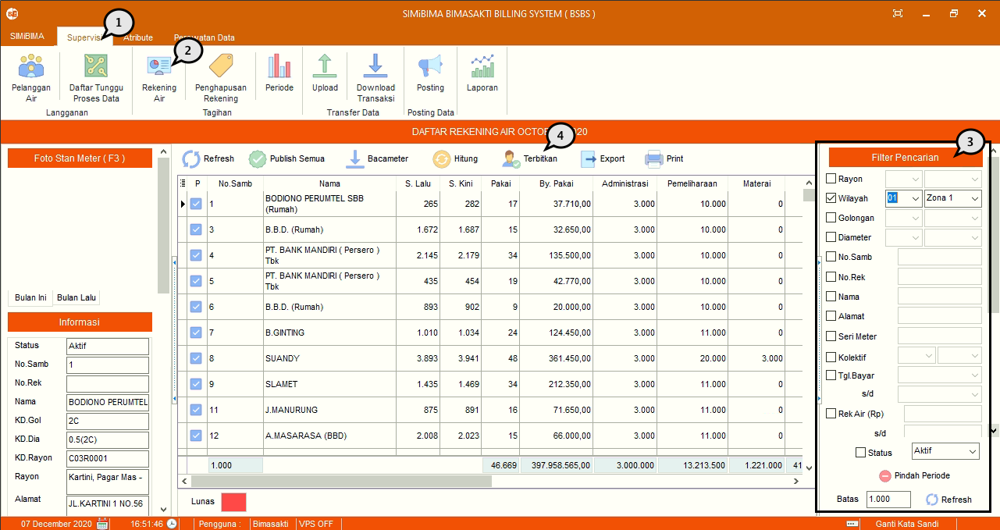
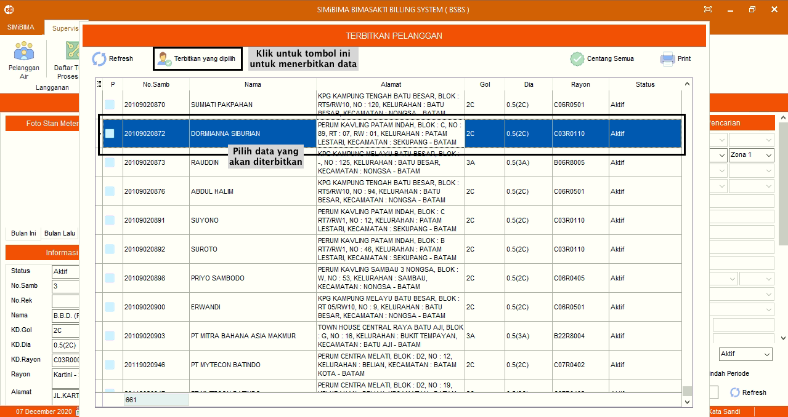
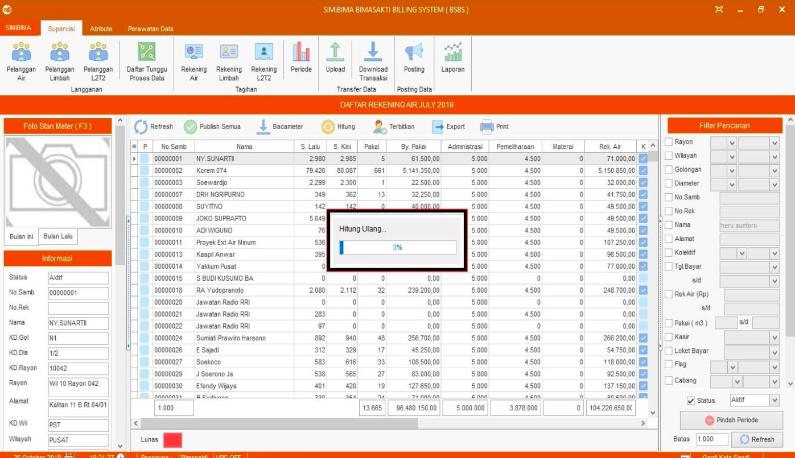
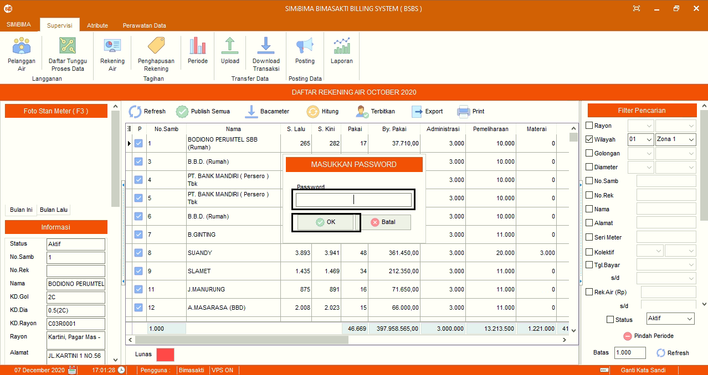

= Menerbitkan Daftar Rekening Air

Berikut adalah langkah-langkah dalam mengoperasikan fitur Rekening Air :

1. Pilih menu *Supervisi*
2. Cari ikon *Rekening Air*
3. Cari data rekening air menggunakan fungsi filter, seperti pada poin 3 pada gambar di atas. Jika sudah, data akan muncul secara otomatis pada tabel
4. Cari ikon terbitkan, seperti poin 4 pada gambar di atas. Jika terdapat pelanggan sambungan baru yang diinputkan dari modul BSHPD akan muncul pada tabel. Pilih data yang ingin diterbitkan terlebih dahulu, jika sudah, tekan tombol *Terbitkan yang Dipilih*. Selanjutnya terdapat _form_ konfirmasi. Jika sudah yakin untuk menerbitkan pelanggan, tekan tombol *Yes* seperti gambar di bawah ini
+

5. Selanjutnya pilih ikon *Bacameter* seperti poin 5 pada gambar utama di atas (berfungsi untuk menarik data stan atau angka meter dari aplikasi Bacameter). Tunggu hingga proses selesai.
+

6. Setelah itu pilih ikon *Hitung Ulang* seperti poin 6 pada gambar utama di atas (berfungsi untuk menghitung ulang pemakaian berdasarkan tarif yang berlaku saat periode bersangkutan). Tunggu hingga proses hitung ulang selesai seperti gambar di bawah ini
+

7. Setelah proses hitung ulang selesai, dilanjutkan dengan proses publish rekening, dengan menekan ikon *Publish Semua*. Selanjutnya masukan _password_ hak akses dan tekan tombol OK untuk melakukan proses _publish_ rekening. Tunggu hingga proses selesai.
+

