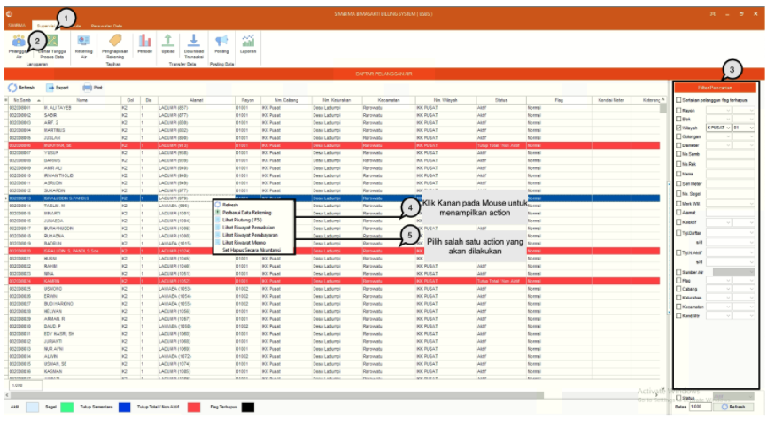
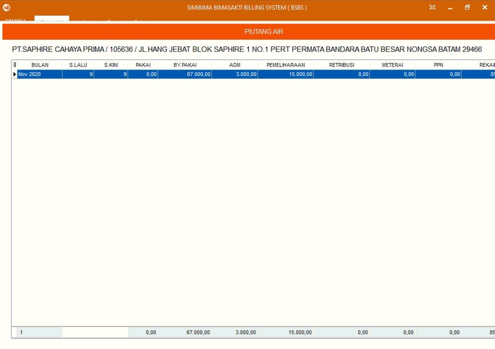

= Mengelola Data Pelanggan Air

Fitur ini berfungsi untuk memanajemen data pelanggan air, baik itu memperbarui, menghapus, lihat piutang, lihat riwayat pemakaian, lihat riwayat pembayaran, lihat riwayat memo, atur flag, balik nama, rubah golongan, ganti meter,  rubah alamat, ganti nomor sambungan, ganti status pelanggan dan set hapus secara akuntansi.  Berikut adalah langkah-langkahnya.

1. Pilih menu *Supervisi*
2. Cari ikon *Pelanggan Air*
3. Gunakan filter pencarian untuk mencari data pelanggan lebih spesifik, jika sudah, tekan tombol Refresh untuk melakukan pencarian
4. Jika filter data yang dimasukan tersedia, maka data secara otomatis muncul pada tabel. Klik kanan pada _mouse_ untuk memunculkan menu seperti pada poin 4 pada gambar di atas
5. Pilih _action_ yang akan dilakukan. Berikut contoh penggunaan action Lihat Piutang
+

6. Sistem akan secara otomatis menampilkan _pop-up_ piutang yang dimiliki oleh pelanggan. Tekan tombol *Escape* pada _keyboard_ untuk menutup _pop-up_.