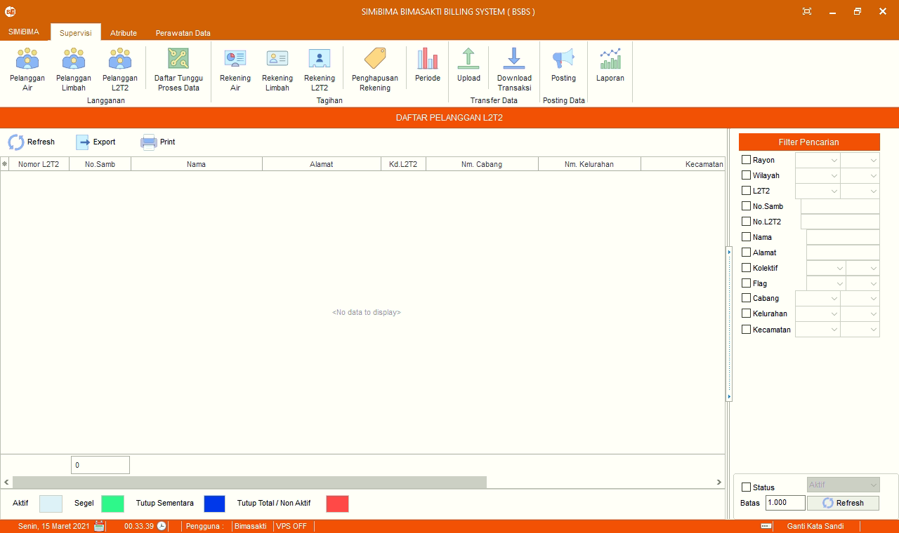

= Mengelola Data Pelanggan L2T2

Fitur ini berfungsi untuk memanajemen data pelanggan limbah tinja, baik itu memperbarui, menghapus, lihat piutang, lihat riwayat pemakaian, lihat riwayat pembayaran, lihat riwayat memo, atur flag, balik nama, rubah golongan, ganti meter,  rubah alamat, ganti nomor sambungan, ganti status pelanggan dan set hapus secara akuntansi.

