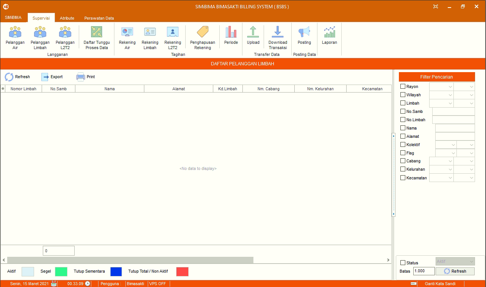

= Mengelola Data Pelanggan Limbah

Fitur ini berfungsi untuk memanajemen data pelanggan limbah, baik itu memperbarui, menghapus, lihat piutang, lihat riwayat pemakaian, lihat riwayat pembayaran, lihat riwayat memo, atur _flag_, balik nama, rubah golongan, ganti meter,  rubah alamat, ganti nomor sambungan, ganti status pelanggan dan set hapus secara akuntansi.

