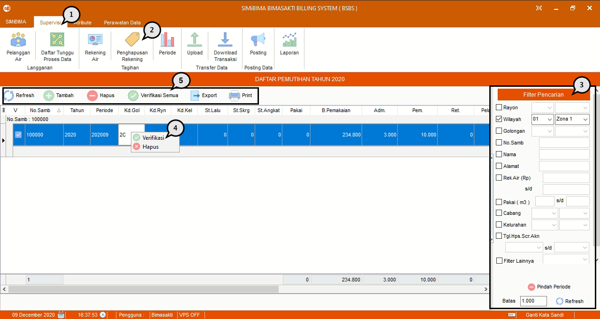
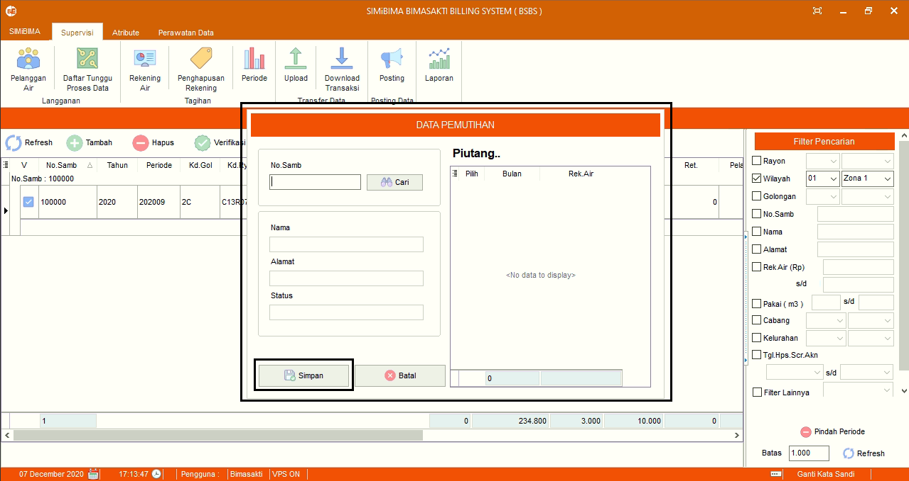
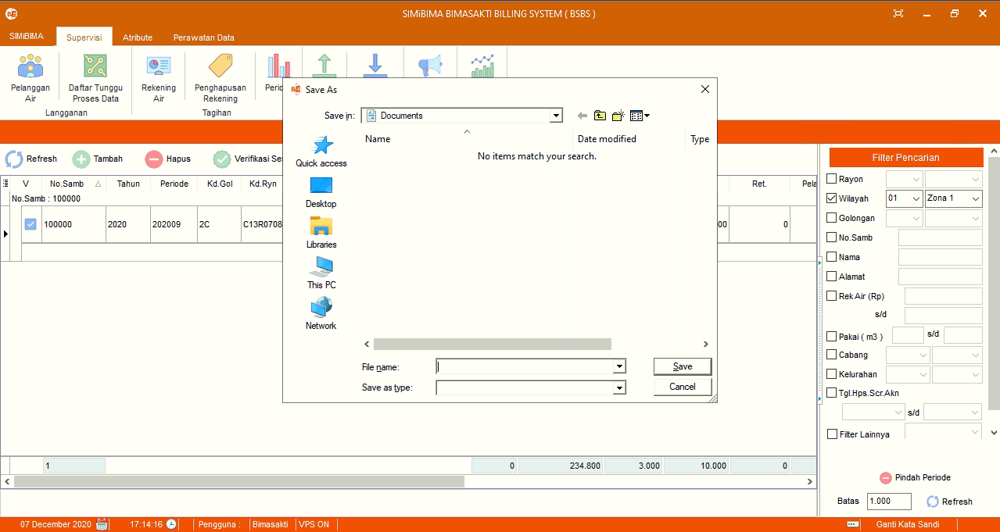
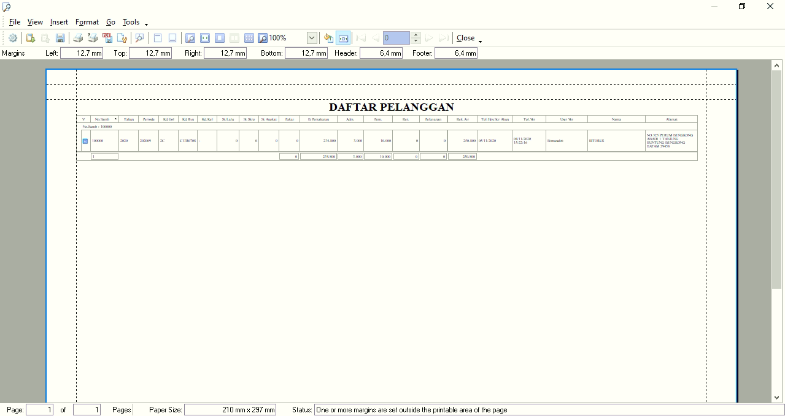

= Menghapus Daftar Rekening Air

Fitur ini berfungsi untuk penghapusan (pemutihan) nomor rekening yang sudah terdaftar sebelumnya. Berikut adalah langkah-langkah untuk menghapusnya.

1. Buka menu *Supervisi*
2. Klik pada *Penghapusan Rekening*
3. Cari data yang ingin dihapus dengan klik menggunakan *Filter* _form_ pada bagian kanan sistem
4. Klik kanan pada data yang ingin dihapus, kemudian klik pada _action_ *Verifikasi* untuk menyetujui pemutihan rekening.
5. _User_ juga dapat melakukan _refresh_ data, menambahkan, menghapus, melakukan verifikasi, _export_, juga _print_ data pemutihan yang sudah difilter dengan tombol _action_ (nomor 5 pada gambar di atas).
* *_Refresh_* digunakan untuk memperbaharui data yang sudah ditampilkan
* Tambah digunakan untuk menambahkan data pemutihan rekening terbaru. Setelah klik pada _action button_, sistem akan menampilkan _form_ penambahan data.
+

Isi semua _field_, kemudian klik pada tombol *Save*.
* *Hapus* sama fungsinya dengan action diklik kanan (untuk menghapus data rekening). Bedanya, dengan tombol _action_ ini, data pemutihan dapat dihapus secara _bulk_ (sekaligus).
* *Verifikasi Semua*  digunakan untuk memverifikasi data pemutihan secara _bulk_ (sekaligus). Untuk melakukannya, pilih semua data yang akan diverifikasi, kemudian klik pada tombol _action_ Verifikasi Semua.
* *_Export_* digunakan untuk mengekspor data dalam bentuk laporan. Klik data yang akan diekspor, klik _action button_ *Export*, kemudian simpan pada direktori yang diinginkan.
+

* *Print* digunakan untuk mencetak data dalam bentuk _hard copy_. Untuk melakukannya, klik pada data yang akan dicetak, kemudian klik tombol _action Print_. Sistem akan menampilkan PDF document, cetak dokumen sesuai kebutuhan.
+

