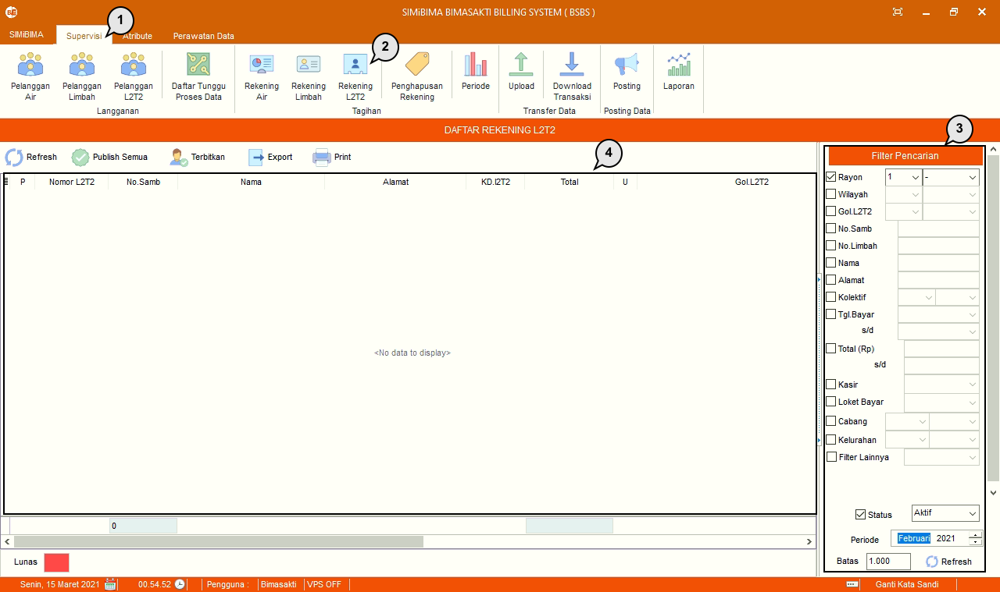

= Mengolah Data Rekening Limbah L2T2

Fitur ini berfungsi untuk mengolah data rekening limbah tinja di setiap periode atau bulan. Berikut adalah langkah-langkah dalam mengoperasikan fitur Rekening L2T2 :

1. Pilih menu *Supervisi*
2. Cari ikon *Rekening L2T2*
3. Cari data rekening L2T2 menggunakan fungsi filter, seperti pada poin 3 pada gambar di atas. Jika sudah, data akan muncul secara otomatis pada tabel
4. Data akan muncul pada tabel poin 4. (Pada gambar di atas, terdapat keterangan _“No data to display”_ karena belum ada PDAM yang menggunakan fitur L2T2)
