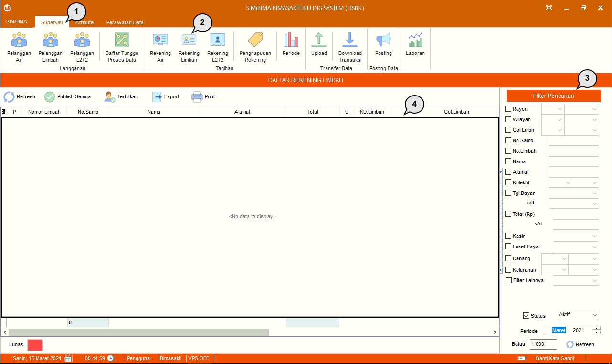

= Mengolah Data Rekening Limbah

Fitur ini berfungsi untuk mengolah data rekening limbah di setiap periode atau bulan. Berikut adalah langkah-langkah dalam mengoperasikan fitur Rekening Limbah :

1. Pilih menu *Supervisi*
2. Cari ikon *Rekening Limbah*
3. Cari data rekening limbah menggunakan fungsi filter, seperti pada poin 3 pada gambar di atas. Jika sudah, data akan muncul secara otomatis pada tabel
4. Data akan muncul pada tabel poin 4. (Pada gambar di atas, terdapat keterangan _“No data to display”_ karena belum ada PDAM yang menggunakan fitur limbah)
