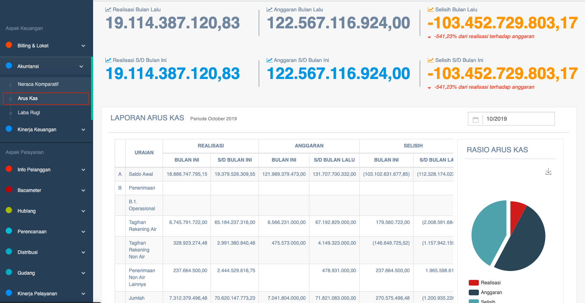

= Menampilkan Data Arus Kas

Data arus kas PDAM dapat ditampilkan dengan cara mengakses fitur *Arus Kas* pada _dropdown menu_ *Akuntansi* yang termasuk dalam Aspek Keuangan. 

Data arus kas yang ditampilkan terdiri dari *dana realisasi* dan *dana anggaran* periode *bulan lalu*, *bulan ini*, dan *sampai bulan ini*. Menggunakan 2 hitungan dana realisasi dan anggaran, maka akan diperoleh hitungan *selisih*. Berikut adalah contoh data yang ditampilkan: 

Fitur arus kas bisa menampilkan data sesuai dengan *tanggal* yang dipilih. Terlampir juga tabel *laporan arus kas* berdasarkan waktu periodik (bulanan) yang berisi detail *uraian*, *realisasi*, *anggaran*, dan *selisih* (bulan ini dan bulan lalu). Selanjutnya, hasil tabel tersebut akan ditampilkan dalam bentuk grafik arus kas dan rasio. 