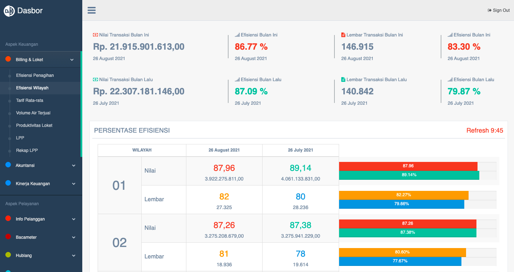
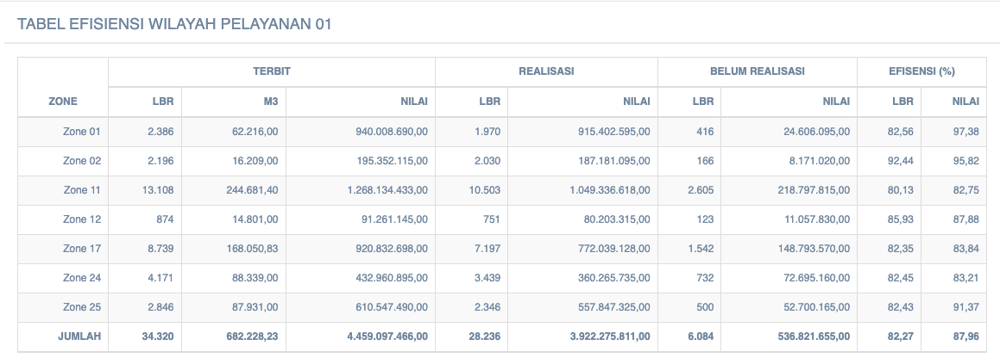

== Menampilkan Data Efisiensi Wilayah

Data efisiensi wilayah PDAM dapat ditampilkan dengan cara mengakses fitur *Efisiensi Wilayah* pada _dropdown menu_ *Billing & Loket* yang termasuk dalam Aspek Keuangan. Berikut adalah contoh data yang ditampilkan: 

Pada tampilan data di atas, bisa didapatkan informasi *nilai transaksi bulan ini* dan *transaksi bulan lalu*, yang mencakup persentase efisiensi dan jumlah lembar transaksi masing-masing. 

Pada *Persentase Efisiensi*, ditampilkan detail data *persentase efisiensi* dan *lembar transaksi* bulan ini dan bulan lalu setiap wilayah dalam bentuk tabel, beserta grafik perbandingannya.

Halaman di atas juga menampilkan tabel efisiensi wilayah pelayanan. Tabel tersebut mencakup 4 kolom utama, yaitu: 

1. Kolom *Terbit* mencakup total lembar transaksi, total M3 wilayah, dan nilai transaksi dalam rupiah sesuai jumlah lembar yang diterbitkan
2. Kolom *Realisasi* mencakup total lembar transaksi dan nilai transaksi dalam rupiah sesuai jumlah lembar yang sudah direalisasikan
3. Kolom *Belum Terealisasi* mencakup total lembar transaksi dan nilai transaksi dalam rupiah sesuai jumlah lembar yang belum terealisasi
4. Kolom *Efisiensi (%)* merangkum persentase efisiensi lembar dan nilai transaksi masing-masing wilayah. Persentase didapatkan dari jumlah terealisasi dibandingkan dengan jumlah total yang lembar terbit.