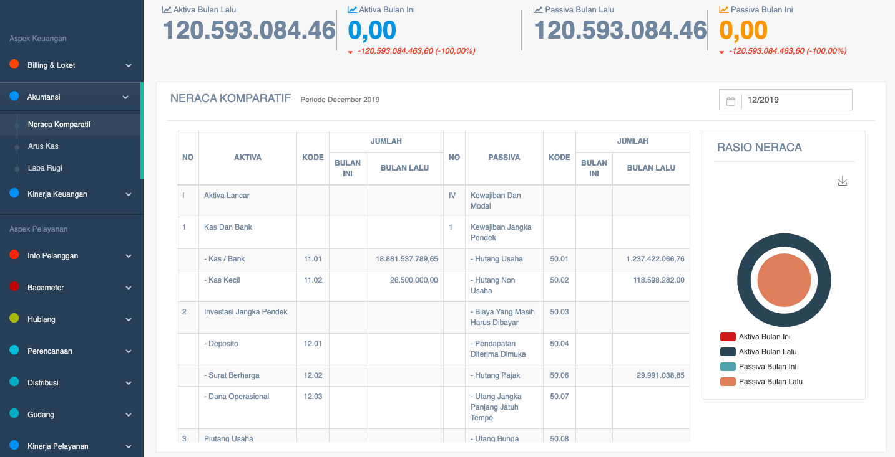

= Menampilkan Data Neraca Aktiva dan Passiva

Data efisiensi wilayah PDAM dapat ditampilkan dengan cara mengakses fitur *Neraca Komparatif* pada _dropdown menu_ *Akuntansi* yang termasuk dalam Aspek Keuangan. 

Data yang ditampilkan meliputi *neraca komparatif meliputi Aktiva bulan lalu, Aktiva bulan ini, Passiva bulan ini*, dan *Passiva bulan lalu*. Berikut adalah contoh data yang ditampilkan: 

Fitur neraca komparatif bisa menampilkan data sesuai dengan *tanggal* dan *wilayah* yang dipilih. Terlampir juga tabel neraca komparatif berdasarkan waktu periodik (bulanan) yang berisi detail *aktiva* (misalnya kas dan bank, surat berharga), *kode*, *jumlah* (bulan ini dan bulan lalu), *detail pasiva* (misalnya utang pajak, utang usaha), *kode*, dan *jumlah* (bulan ini dan bulan lalu).

Tidak hanya ditampilkan dalam bentuk hasil akhir hitungan, tapi juga ada laporan detailnya yang bisa dilihat melalui tabel *neraca komparatif* (periode bulanan). Selanjutnya, hasil tabel tersebut akan ditampilkan dalam bentuk grafik neraca komparatif dan rasio.  

Tabel neraca komparatif adalah tampilan pratinjau _(preview)_, jadi untuk melihat kesesuaian secara detail bisa dilihat melalui *laporan keuangan*.