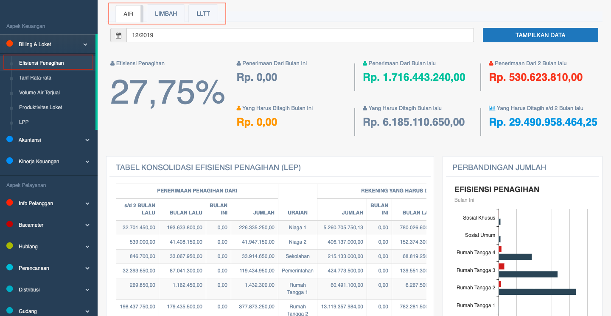
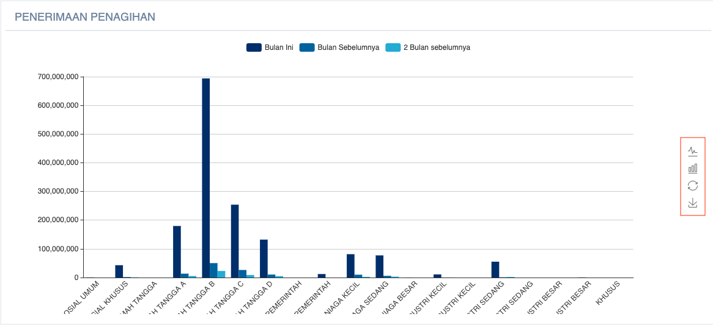

= Menampilkan Data Penerimaan dan Penagihan Air

Data penerimaan dan penagihan PDAM dapat ditampilkan dengan cara mengakses fitur *Efisiensi Penagihan* pada _dropdown menu_ *Billing & Loket* yang termasuk dalam Aspek Keuangan. 

Data yang ditampilkan mencakup penerimaan dan penagihan air yang didapatkan dari hitungan bulan ini, lalu, dan 2 bulan sebelumnya. Berikut adalah contoh data yang ditampilkan: 

Seperti yang bisa dilihat melalui gambar di atas, fitur efisiensi penagihan akan menampilkan 3 kategori data, antara lain:

1. Efisiensi Penagihan *Air*, berlaku untuk semua produk air
2. Efisiensi Penagihan *Limbah*, berlaku untuk limbah rumah tangga
3. Efisiensi Penagihan *LLTT*, berlaku untuk layanan lumpur tinja terjadwal

Ketiga kategori diatas akan ditampilkan sesuai dengan tanggal dan wilayah yang dipilih. Adapun data yang ditampilkan meliputi: *efisiensi penagihan*, *penerimaan dari bulan ini*, *penerimaan dari bulan lalu*, *penerimaan dari 2 bulan lalu*, *efisiensi penagihan sampai saat ini*, *yang harus ditagih bulan ini*, *yang harus ditagih bulan lalu*, *yang harus ditagih 2 bulan lalu*, dan *piutang saat ini*.

Tidak hanya ditampilkan dalam bentuk hasil akhir hitungan, tapi juga ada laporan detailnya yang bisa dilihat melalui tabel *konsolidasi efisiensi penagihan (LEP)*. Kemudian, hasil tabel tersebut akan ditampilkan dalam bentuk diagram untuk mendapatkan data perbandingan jumlah per golongan. Adapun contoh gambar diagramnya dapat dilihat di bawah ini.

Selain bisa menampilkan diagram batang, tampilannya juga bisa diubah sesuai dengan _action button_ yang tersedia.

1. Tombol *Text* untuk menampilkan versi teks
2. Tombol *Bar* untuk menampilkan versi diagram batang
3. Tombol *Restore* untuk mengembalikan tampilan data seperti sebelumnya
4. Tombol *Save Image* untuk menyimpan data yang ditampilkan 