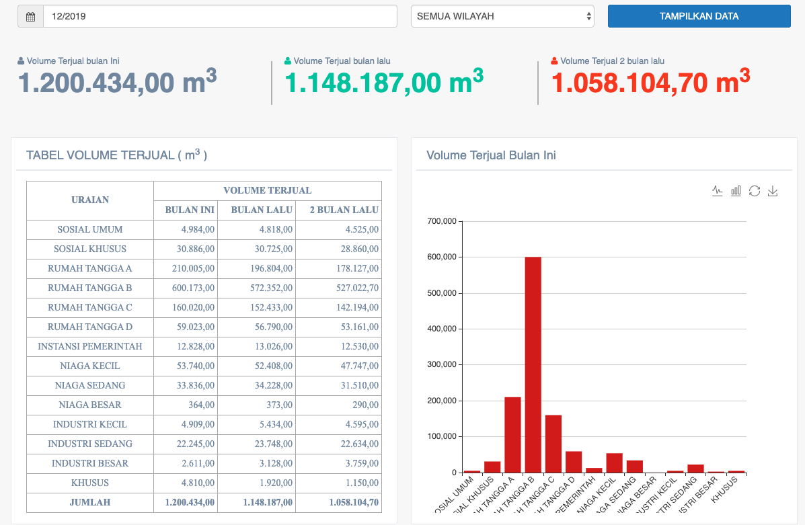

= Menampilkan Data Penjualan Volume Air Bulanan

Data penjualan volume air bulanan PDAM dapat ditampilkan dengan cara mengakses fitur *Volume Air Terjual* pada _dropdown menu_ *Billing & Loket* yang termasuk dalam Aspek Keuangan. 

Data yang ditampilkan adalah volume air terjual bulan ini, bulan lalu, dan 2 bulan lalu. Jika pada fitur tarif rata-rata, data yang ditampilkan adalah hasil dari Daftar Rekening Ditagih (DRD), lain halnya dengan fitur volume air terjual. Pada fitur ini, data yang ditampilkan adalah hasil dari volume air berdasarkan *pemakaian*. Hal tersebut berarti data bisa lebih banyak atau sedikit dari yang ditampilkan pada fitur tarif rata-rata. Berikut adalah contoh tampilan fitur volume air terjual. 

Seperti yang bisa dilihat melalui gambar di atas, fitur volume air terjual akan menampilkan data sesuai dengan *tanggal* dan *wilayah* yang dipilih. Adapun data yang ditampilkan meliputi: *volume terjual bulan ini*, *volume terjual bulan lalu*, dan *volume terjual 2 bulan lalu*.

Tidak hanya ditampilkan dalam bentuk hasil akhir hitungan, tapi juga ada laporan detailnya yang bisa dilihat melalui tabel *volume terjual (m3)*. Kemudian, hasil tabel tersebut akan ditampilkan dalam bentuk diagram untuk mendapatkan data perbandingan jumlah per golongan.
