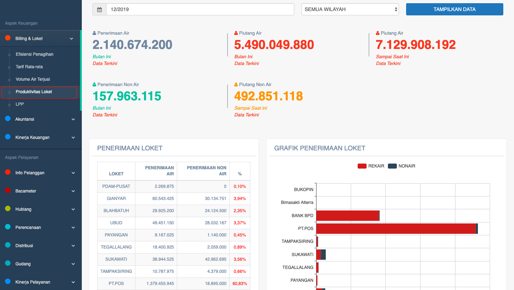

= Menampilkan Data Produktivitas Loket

Data produktivitas PDAM dapat ditampilkan dengan cara mengakses fitur *Produktivitas Loket* pada _dropdown menu_ *Billing & Loket* yang termasuk dalam Aspek Keuangan. Data yang ditampilkan meliputi *penerimaan air*, *piutang air*, *penerimaan non air*, dan *piutang non air*. Berikut adalah contoh data yang ditampilkan: 

Seperti yang bisa dilihat melalui gambar di atas, fitur produktivitas loket akan menampilkan data sesuai dengan *tanggal* dan *wilayah* yang dipilih. Tidak hanya ditampilkan dalam bentuk hasil akhir hitungan, tapi terdapat juga laporan detail yang dapat dilihat melalui *tabel penerimaan loket*. Selanjutnya, hasil tabel tersebut akan ditampilkan dalam bentuk grafik penerimaan loket (rekening air atau non air) berdasarkan wilayah.  