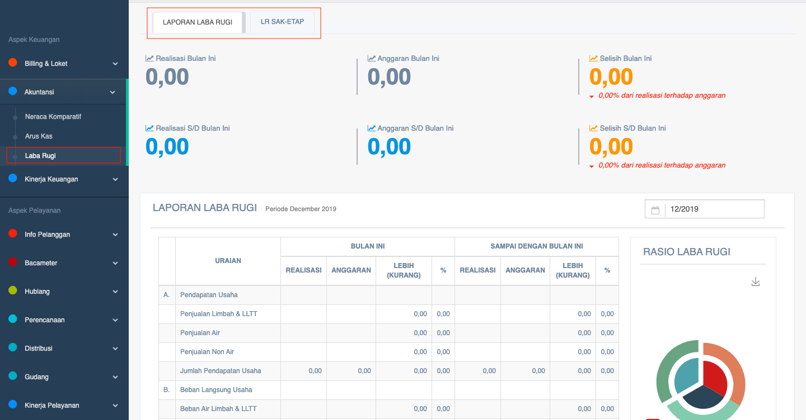

= Menampilkan Laporan Laba Rugi

Laporan Laba Rugi PDAM dapat ditampilkan dengan cara mengakses fitur *Laba Rugi* pada _dropdown menu_ *Billing & Loket* yang termasuk dalam Aspek Keuangan. Laporan yang ditampilkan terdiri dari 2 kategori, yaitu *laba rugi (PERMENDAGRI)* dan *LR SAK-ETAP (Standar Akuntansi Keuangan untuk Entitas)*.  LR SAK-ETAP di sini dibuat sesuai dengan BPKP. 

Berikut adalah contoh data laporan yang ditampilkan: 

Sama seperti fitur Arus Kas, fitur Laba Rugi juga menampilkan data *dana realisasi* serta *dana anggaran* untuk periode *bulan ini* dan *bulan lalu*. Dari dua (2) data dana tersebut, kemudian akan dihitung selisihnya.
