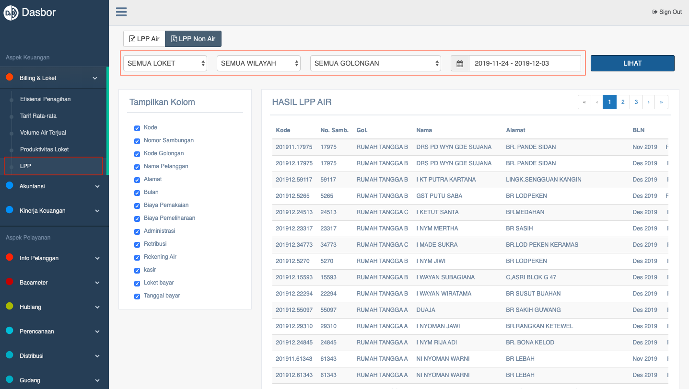

= Menampilkan Laporan Tagihan Air dan Non Air

Laporan Tagihan dapat ditampilkan dengan cara mengakses fitur *LPP* pada _dropdown menu_ *Billing & Loket* yang termasuk dalam Aspek Keuangan. 

LPP merupakan singkatan dari *laporan penerimaan penagihan*. Fitur ini menyajikan 2 kategori, yaitu *LPP Air* dan *LPP Non Air*. Baik dalam kategori fitur LPP air maupun non air, data yang akan ditampilkan dapat dipilih berdasarkan *loket*, *wilayah*, *golongan*, dan *periode (tanggal)*. Berikut adalah tampilan halaman LPP untuk kategori non air. 

Setelah memilih filter loket, wilayah, golongan, dan periode, halaman akan menampilkan tabel hasil *LPP non air*. Adapun informasi yang tersaji dalam tabel dapat diatur sesuai kebutuhan dengan cara memberi tanda *centang* pada _field_ *Tampilan Kolom*.