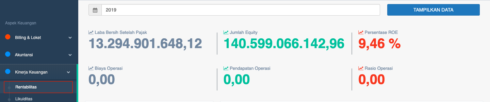
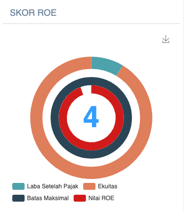
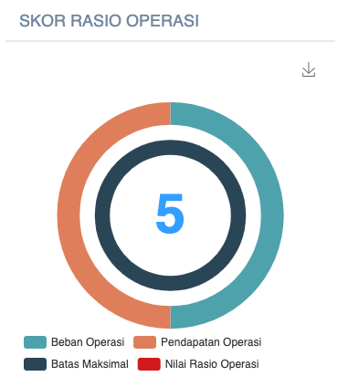
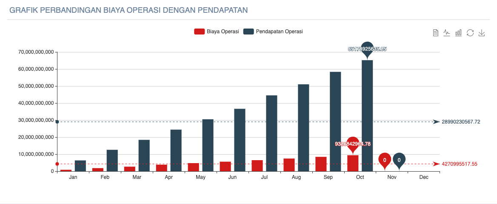

= Menampilkan Persentase Kinerja dari ROE dan Rasio Operasi

Persentase Kinerja PDAM dari ROE dan rasio operasi dapat ditampilkan dengan cara mengakses fitur *Rentabilitas* pada _dropdown menu_ *Kinerja Keuangan* yang termasuk dalam Aspek Keuangan. 

Fitur Rentabilitas akan menampilkan dua (2) data kinerja, yaitu *ROE (Return on Equity)* dan *Rasio Operasi*. Masing-masing kinerja memiliki indikator, cara hitung, dan standar penilaian sendiri.

1. *Indikator kinerja ROE*
+
ROE adalah salah satu indikator yang biasa digunakan untuk mengetahui tingkat profitabilitas suatu perusahaan dengan cara membandingkan laba bersihnya terhadap jumlah equity-nya. ROE, rasio yang mengukur kemampuan tingkat pengembalian terhadap jumlah equity. ROE memiliki Bobot 0.055. *ROE = (Laba bersih setelah pajak / Jumlah equity) * 100%*
+

+
*Standar Penilaian ROE*
+
|===
|  *Standar*   | *Nilai* 
|    >= 10%    |   5   
| 7 - < 10 (%) |   4   
|  3 - < 7 (%) |   3   
|  0 - <3 (%)  |   2   
|    < 0 (%)   |   1   
|===

2. *Indikator kinerja Rasio Operasi*
+
Rasio Operasi (RO) adalah indikator yang dapat menunjukan sejauh mana manajemen PDAM dapat melakukan efisiensi/pengendalian biaya operasi dan sejauh mana manajemen PDAM dapat melakukan upaya-upaya peningkatan pendapatannya sehingga mampu menghasilkan pendapatan yang cukup untuk menutup biaya operasi.
+
Rasio Operasi bertujuan untuk mengukur seberapa besar efisiensi biaya yang dikeluarkan untuk menghasilkan pendapatan. Rasio Operasi memiliki Bobot 0.055
+
*Rasio Operasi = (Biaya Operasi / Pendapatan Operasi)*
+

+
*Standar Penilaian Rasio Operasi*
+
|===
|  *Standar*   | *Nilai* 
|     <= 0.5    |   5   
|  > 0.5 - 0.65 |   4   
| > 0.65 - 0.85 |   3   
|  > 0.85 - 1.0 |   2   
|     > 1.0     |   1   
|===
+ 
Setelah mendapatkan masing-masing skor rasio, berikutnya akan ditampilkan grafik *perbandingan biaya operasi dengan pendapatan* seperti yang bisa dilihat di bawah ini.
+
