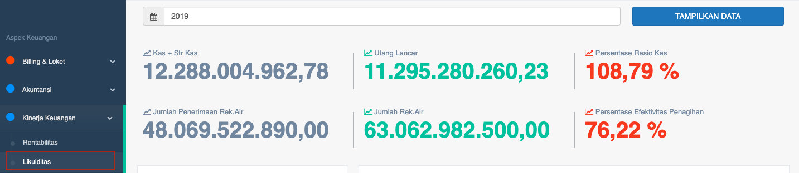
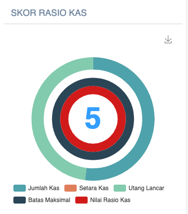
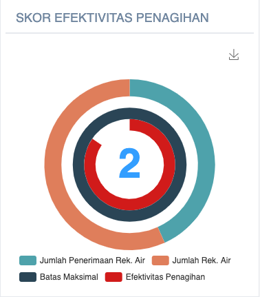
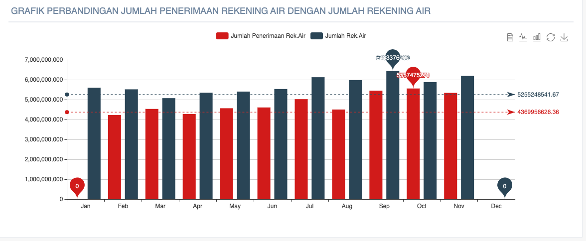

= Menampilkan Persentase Kinerja dari Rasio Kas dan Efektivitas Penagihan

Persentase Kinerja PDAM dari rasio kas dan efektivitas penagihan dapat ditampilkan dengan cara mengakses fitur *Likuiditas* pada _dropdown menu_ *Kinerja Keuangan* yang termasuk dalam Aspek Keuangan. 

Fitur Likuiditas akan menampilkan dua (2) data kinerja, yaitu *Rasio Kas* dan *Efektivitas Penagihan*. Masing-masing kinerja memiliki indikator, cara hitung, dan standar penilaian sendiri.

1. *Indikator Kinerja Rasio Kas*
+
Indikator ini digunakan untuk melihat sejauh mana Kas PDAM mampu memenuhi kewajiban-kewajiban jangka pendeknya. Rasio Kas untuk mengukur kemampuan kas dalam rangka menjamin kewajiban jangka pendek. Rasio Kas memiliki Bobot 0.055.
+
*Rasio Kas = ( Kas+Str Kas / Utang Lancar ) * 100%*
+

+
*Standar Penilaian Rasio Kas*
+
|===
|    Standar    | Nilai 
|     <= 0.5    |   5   
|  > 0.5 - 0.65 |   4   
| > 0.65 - 0.85 |   3   
|  > 0.85 - 1.0 |   2   
|     > 1.0     |   1   
|===

2. *Indikator kinerja efektivitas penagihan*
+
Efektivitas penagihan adalah indikator yang dapat menunjukan sejauh mana PDAM mampu mengelola pendapatan dari hasil penjualan air kepada pelanggan (piutang air) secara efektif sehingga menjadi penerimaan PDAM.
+
Efektivitas penagihan untuk mengukur efektivitas kegiatan penagihan atas hasil penjualan air. Rasio Operasi Memiliki Bobot 0.055.
+
*EP = (Jumlah penerimaan rek.Air/Jumlah rek.Air) * 100%*
+

+
*Standar Penilaian Efektivitas Penagihan*
+
|===
|    Standar    | Nilai 
|     >= 90%    | 5 
| 85 - < 90 (%) | 4 
| 80 - < 85 (%) | 3 
| 75 - < 80 (%) | 2 
|    < 75 (%)   | 1 
|===
+
Setelah mendapatkan masing-masing skor rasio, berikutnya akan ditampilkan grafik *perbandingan jumlah penerimaan rekening air dengan jumlah rekening air* seperti yang bisa dilihat di bawah ini.
+
