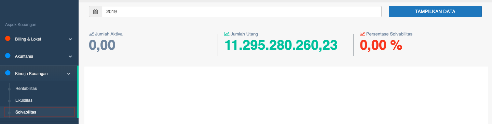
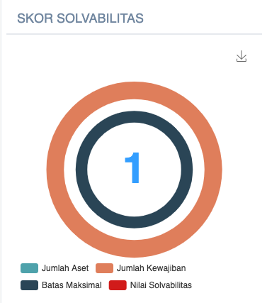
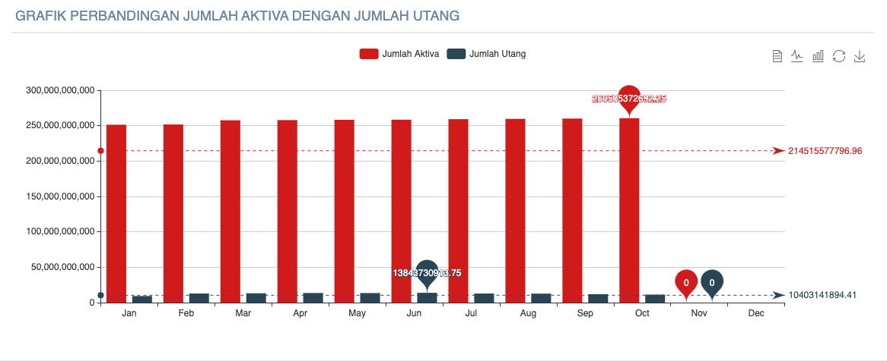

= Menampilkan Persentase Kinerja dari Solvabilitas

Persentase Kinerja PDAM dari solvabilitas dapat ditampilkan dengan cara mengakses fitur *Solvabilitas* pada _dropdown menu_ *Kinerja Keuangan* yang termasuk dalam Aspek Keuangan. Fitur ini hanya menampilkan 1 data saja, yaitu *Solvabilitas*, lengkap dengan indikator, cara hitung, dan standar penilaian.

1. *Indikator kinerja solvabilitas*
+
Solvabilitas adalah salah satu indikator untuk mengetahui sejauh mana PDAM mempunyai kemampuan aktiva / aset dalam menjamin kewajiban / hutang jangka panjangnya, atau rasio yang mampu menggambarkan seberapa besar beban hutang yang dapat ditanggung PDAM dibandingkan dengan jumlah aktiva / asetnya.
+
Solvabilitas dinilai untuk mengetahui kemampuan PDAM menjamin kewajiban-kewajiban jangka panjangnya oleh asetnya. Solvabilitas menunjukkan kemampuan perusahaan untuk melunasi seluruh hutang yang ada dengan menggunakan seluruh aset yang dimilikinya. Rasio ini mengukur kemampuan dalam rangka memenuhi seluruh kewajibannya terhadap total aset. Solvabilitas memiliki Bobot 0.03.
+
*Solvabilitas = ( Jumlah aktiva / Jumlah utang ) * 100%*
+

+
*Standar Penilaian Solvabilitas*
+
|===
|     Standar     | Nilai 
|     >= 200%     |   5   
| 170 - < 200 (%) |   4   
| 135 - < 170 (%) |   3   
| 100 - < 135 (%) |   2   
|    < 100 (%)    |   1   
|===
+
Setelah mendapatkan masing-masing skor rasio, berikutnya akan ditampilkan *grafik perbandingan jumlah aktiva dengan jumlah utang* seperti yang bisa dilihat di bawah ini.
+
