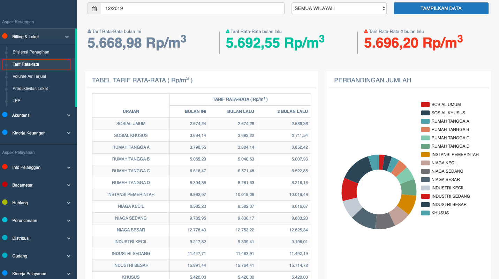
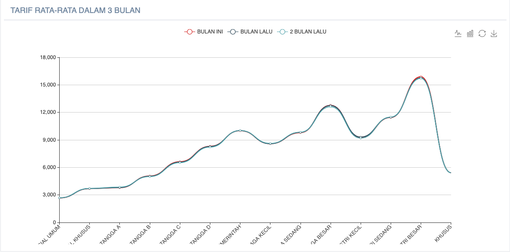

= Menampilkan Tarif Rata-Rata PDAM

Data tarif rata-rata PDAM dapat ditampilkan dengan cara mengakses fitur *Tarif Rata-Rata* pada _dropdown menu_ *Billing & Loket* yang termasuk dalam Aspek Keuangan. Data yang ditampilkan dihitung dari Daftar Rekening Ditagih (DRD). Berikut adalah contoh data yang ditampilkan: 

Seperti yang bisa dilihat melalui gambar di atas, fitur Tarif Rata-Rata akan menampilkan data sesuai dengan tanggal dan wilayah yang dipilih. Adapun data yang ditampilkan meliputi *tarif rata-rata bulan ini*, *tarif rata-rata bulan lalu*, dan *tarif rata-rata 2 bulan lalu*.

Sementara itu, perhitungannya didapatkan dari jumlah pesanan (dalam rupiah) dibagi kubikasi (m3). Tidak hanya ditampilkan dalam bentuk hasil akhir hitungan, tapi juga ada laporan detailnya yang bisa dilihat melalui tabel *tarif rata-rata (Rp/m3)*. Kemudian, hasil tabel tersebut akan ditampilkan dalam bentuk diagram untuk mendapatkan data perbandingan jumlah per golongan. Adapun contoh gambar diagramnya dapat dilihat di bawah ini.

