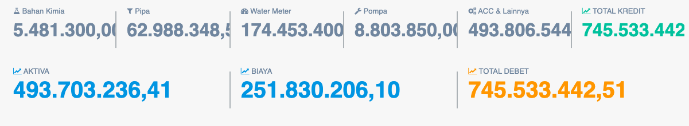

= Menampilkan Perhitungan Biaya Pemakaian Bahan Instalasi dan Kimia

Perhitungan Biaya Pemakaian Bahan Instalasi dan Kimia PDAM dapat ditampilkan dengan cara mengakses fitur *beban pemakaian bahan instalasi dan kimia* pada _dropdown menu_ *Produksi Air & NRW* yang termasuk dalam Aspek Operasional. Data yang ditampilkan melalui fitur ini adalah hitungan debit dan kredit *bahan kimia*, *pipa*, *water meter*, *pompa*, *ACC & lainnya*, *total kredit*, *total debit*, *aktiva*, dan *biaya*. 

Berikut adalah gambar tampilan beban pemakaian bahan instalasi dan kimia beserta keterangannya.

Selain menampilkan data hitungan di atas, fitur ini juga menampilkan tabel pemakaian bahan instalasi dan kimia secara detail dalam periode bulanan yang bisa dipilih melalui kolom _dropdown_ *date*.