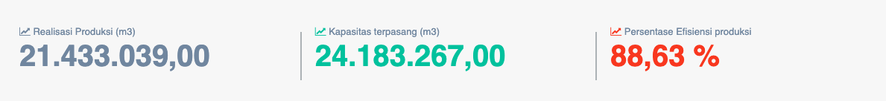
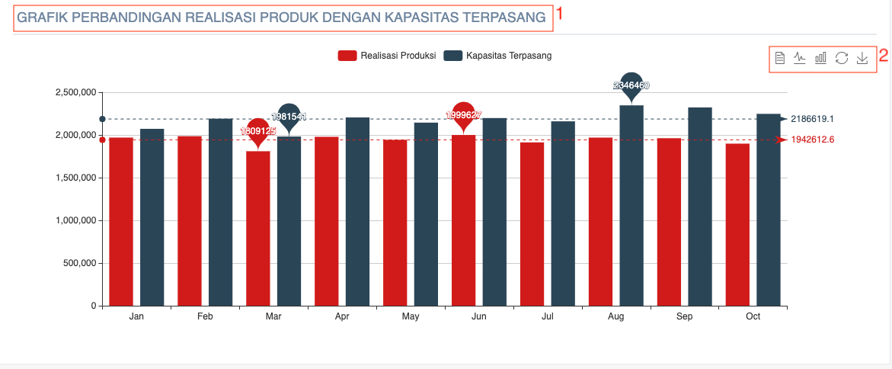

= Menampilkan Persentase Efisiensi Produksi PDAM

Persentase efisiensi produksi PDAM dapat ditampilkan dengan cara mengakses fitur *Efisiensi Produksi* pada _dropdown menu_ *Kinerja Operasional* yang termasuk dalam Aspek Operasional.

Data Efisiensi produksi yang ditampilkan oleh sistem adalah salah satu indikator yang menunjukan sejauh mana efisiensi PDAM dalam memanfaatkan kapasitas terpasangnya. Bobot efisiensi produksi adalah 0.07.
 
*Efisiensi Produksi = (Realisasi Produksi (m3) / Kapasitas terpasang (m3)) * 100%*

== Standar Penilaian Efisiensi Produksi

|===
| *Standar* | *Nilai*
| >= 90% | 5
| 80 - < 90 (%) | 4
| 70 - < 80 (%) | 3
| 60 - < 70 (%) | 2
| < 60 (%) | 1
|===

== Grafik Efisiensi Produksi

Untuk mengakses grafik efisiensi produksi, Anda dapat memilih _dropdown_ *Kinerja Operasional*, kemudian klik pada pilihan *Efisiensi Produksi*. Berikut adalah gambar tampilan grafik perbandingan realisasi produk dengan kapasitas terpasang beserta keterangannya. 

1. Judul grafik perbandingan realisasi produk dengan kapasitas terpasang
2. Daftar ikon yang dapat digunakan:
+
- Ikon *text* digunakan untuk menampilkan grafik "perbandingan realisasi produk" dengan "kapasitas terpasang" dalam bentuk tabel informasi berisi teks
- Ikon *line* digunakan untuk menampilkan grafik "perbandingan realisasi produk" dengan "kapasitas terpasang" dalam bentuk diagram garis
- Ikon *bar* digunakan untuk menampilkan grafik "perbandingan realisasi produk" dengan "kapasitas terpasang" dalam bentuk diagram batang
- Ikon *restore* digunakan untuk mengembalikan data grafik "perbandingan realisasi produk" dengan "kapasitas terpasang" seperti sebelumnya
- Ikon *save* digunakan untuk menyimpan data "perbandingan realisasi produk" dengan "kapasitas terpasang" yang telah dimasukkan ke dalam sistem
