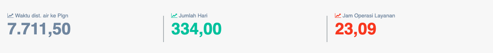

= Menampilkan Persentase Jam Operasi Pelayanan

Persentase jam operasi pelayanan dapat diakses melalui _dropdown_ *Kinerja Operasi*, kemudian klik pada pilihan *Jam Operasi Layanan*. Persentase ini digunakan untuk mengukur efisiensi sistem secara keseluruhan dan kaitannya dengan kontinuitas pelayanan. Selain itu, jam operasi layanan juga digunakan sebagai indikator untuk mengetahui sejauh mana PDAM mampu mempertahankan pelayanan pengaliran air kepada pelanggannya dengan tingkat pelayanan kontinyu 1 x 24 jam per harinya. Jam operasi Layanan memiliki bobot 0.08.
 
*Jam Operasi Layanan = Waktu dist. air ke Plgn dalam 1 tahun / 365 hari*

== Standar Penilaian Jam Operasi Layanan

|===
| *Standar* | *Nilai*
| 21 - 24 (jam) | 5
| 18 -< 21 (jam) | 4
| 16 -< 18 (jam) | 3
| 12 -< 16 (jam) | 2
| < 12 (jam) | 1
|===
