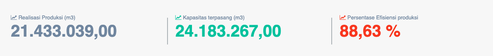
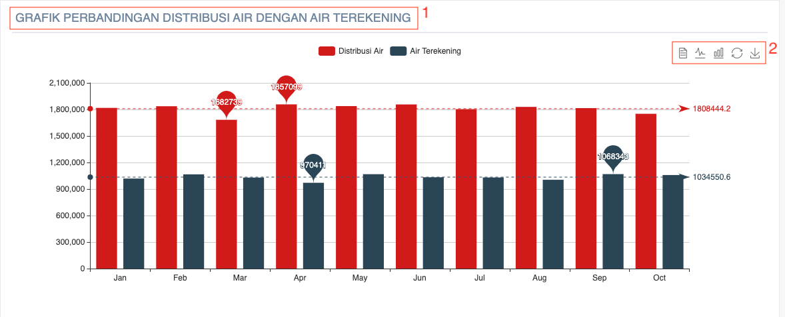

= Menampilkan Persentase Kehilangan Air

Persentase kehilangan air PDAM dapat ditampilkan dengan cara mengakses fitur *Kehilangan Air* pada _dropdown menu_ *Kinerja Operasional* yang termasuk dalam Aspek Operasional. Data yang ditampilkan mencakup *data distribusi air (m3)*, *air terekening (m3)*, dan *persentase kehilangan air/tidak berekening*. 

Kehilangan Air/Tidak Berekening adalah salah satu indikator yang menunjukan sejauh mana manajemen PDAM mampu mengendalikan penjualan barang produknya, yaitu air minum melalui sistem distribusi perpipaan. Kehilangan Air/Tidak Berekening Memiliki Bobot 0.07.

*Kehilangan Air/Tidak Berekening = (Distribusi air - Air terekening (m3) / Distribusi air (m3)) * 100%*

== Standar Penilaian Kehilangan Air

|===
| *Standar* | *Nilai*
| <= 25 (%) | 5
| > 25 - 30 (%) | 4
| > 30 - 35 (%) | 3
| > 35 - 40 (%) | 2
| > 40 (%) | 1
|===

== Grafik Kehilangan Air

Kehilangan air dapat dilihat dari selisih grafik perbandingan distribusi air dengan air terekening. Untuk mengakses grafik tersebut, Anda dapat memilih _dropdown_ *Kinerja Operasional*, kemudian klik pada pilihan *Kehilangan Air*. Berikut adalah gambar tampilan grafik perbandingan realisasi produk dengan kapasitas terpasang beserta keterangannya. 

1. Judul grafik perbandingan distribusi air dengan air terekening
2. Daftar ikon yang dapat digunakan:
+
- Ikon *text* digunakan untuk menampilkan grafik perbandingan distribusi air dengan air terekening dalam bentuk tabel informasi berisi teks 
- Ikon *line* digunakan untuk menampilkan grafik perbandingan distribusi air dengan air terekening dalam bentuk diagram garis
- Ikon *bar* digunakan untuk menampilkan grafik perbandingan distribusi air dengan air terekening dalam bentuk diagram batang
- Ikon *restore* digunakan untuk mengembalikan grafik perbandingan distribusi air dengan air terekening terpasang seperti sebelumnya
- Ikon *save* digunakan untuk menyimpan data perbandingan realisasi produk dengan kapasitas terpasang yang telah dimasukkan ke dalam sistem