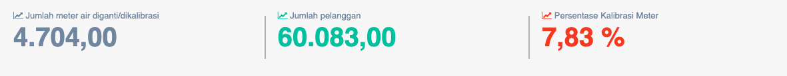

= Menampilkan Persentase Pergantian / Kalibrasi Meter Air Pelanggan

Persentase tekanan air sambungan pelanggan dapat diakses melalui _dropdown_ *Kinerja Operasi*, kemudian klik pada pilihan *Penggantian/kalibrasi meter*. Persentase ini digunakan untuk mengukur tingkat ketelitian / akurasi meter air pelanggan. Selain itu, digunakan juga sebagai indikator yang untuk menilai sejauh mana manajemen PDAM melakukan penggantian meter atau melakukan kalibrasi meter pelanggannya sesuai ketentuan yang berlaku, agar akurasi meter air pelanggan menjadi lebih terjamin. Penggantian / Kalibrasi Meter Pelanggan memiliki bobot 0.065.
 
*Penggantian/Kalibrasi Meter Pelanggan = (Jumlah meter air diganti/dikalibrasi pada tahun / Jumlah pelanggan) * 100%*

== Standar Penilaian Pergantian/Kalibrasi Meter

|===
| *Standar* | *Nilai*
| >= 20 (%) | 5
| 15 -< 20 (%) | 4
| 10 -< 15 (%) | 3
| 5 -< 10 (%) | 2
| < 5 (%) | 1
|===