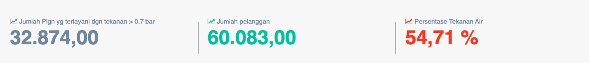

= Menampilkan Persentase Tekanan Air Sambungan Pelanggan

Persentase tekanan air sambungan pelanggan dapat diakses melalui _dropdown_ *Kinerja Operasi*, kemudian klik pada pilihan *Tekanan Air pada samb. pelanggan*. Persentase ini digunakan untuk mengukur jumlah pelanggan yang dilayani dengan tekanan sesuai dengan standar minimal. Tekanan Air pada Sambungan Pelanggan Memiliki Bobot 0.065
 
Tekanan Air pada Sambungan Pelanggan merupakan indikator yang digunakan untuk melengkapi indikator Jam Operasi Layanan dan Indikator Kualitas Air dalam upaya untuk mengetahui sejauh mana PDAM telah mampu mempertahankan pelayanannya dengan kualifikasi Air Minum, dimana capaiannya harus memenuhi syarat 3K. Indikator ini digunakan untuk mengetahui capaian tekanan air PDAM pada rata-rata pipa pelanggannya.
 
*Tekanan Air pada Sambungan Pelanggan = (Jumlah Plgn yg terlayani dgn tekanan > 0.7 bar / Jumlah pelanggan) * 100%*

== Standar Penilaian Tekanan Air pada Sambungan Pelanggan

|===
| *Standar* | *Nilai*
| >= 80 (%) | 5
| 60 -< 80 (%) | 4
| 40 -< 60 (%) | 3
| 20 -< 40 (%) | 2
| < 20 (%) | 1
|===