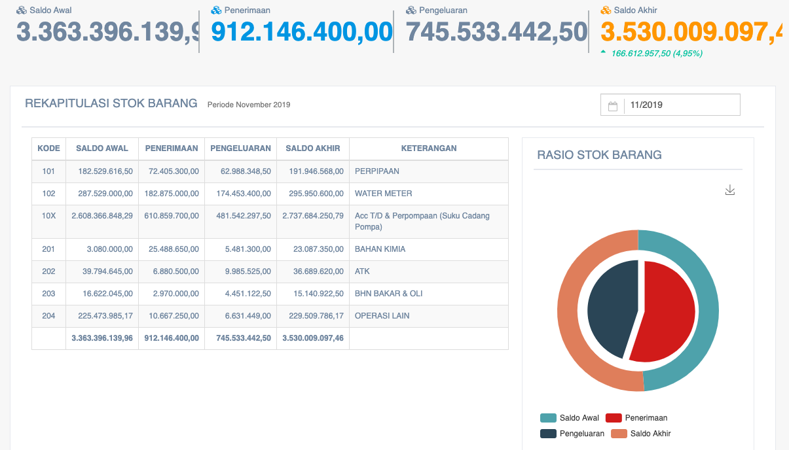

= Melakukan Pemantauan Rekapitulasi Stok Barang

Pemantauan Rekapitulasi Stok Barang PDAM per bulannya dapat dilakukan dengan dengan mengakses fitur *Stok Barang* pada _dropdown menu_ *Gudang* yang termasuk dalam Aspek Pelayanan. Adapun data yang ditampilkan berupa *kode, saldo awal, penerimaan, pengeluaran, saldo akhir,* dan *keterangan*. 

Berikut adalah contoh data yang ditampilkan:

