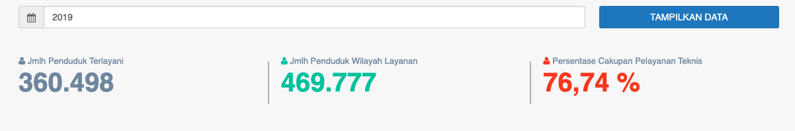

= Menampilkan Data Cakupan Pelayanan Pelanggan

Data cakupan pelayanan pelanggan dapat ditampilkan dengan dengan mengakses fitur *Cakupan Pelayanan Teknis* pada _dropdown menu_ *Kinerja Pelayanan* yang termasuk dalam Aspek Pelayanan. Data ini digunakan untuk mengetahui berapa besar persentase jumlah penduduk terlayani oleh PDAM dibandingkan dengan jumlah penduduk di wilayah pelayanan PDAM. 

Indikator yang digunakan berguna untuk mengetahui sejauh mana manajemen PDAM telah mampu melakukan pelayanan air terhadap wilayah pelayanan teknisnya. Cakupan Pelayanan Teknis Memiliki Bobot 0.05

*Cakupan Pelayanan Teknis (% Per tahun) = (Jumlah Penduduk Terlayani / Jumlah Penduduk Wilayah Layanan) x 100%*

*Standar Penilaian Kinerja Cakupan Pelayanan Teknis*

|===
^.^h|    *Standar*    ^.^h| *Nilai*
|     > 80%     |   5   
| 60 - < 80 (%) |   4   
| 40 - < 60 (%) |   3   
| 20 - < 40 (%) |   2   
|    < 20 (%)   |   1  
|===

Kemudian, ada juga tabel dan grafik pelayanan penduduk yang dikategorikan per kecamatan.
