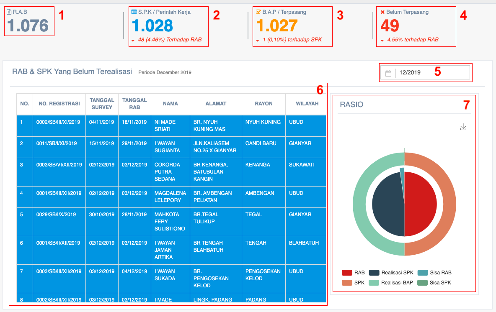

= Menampilkan Data Evaluasi SPK dan Pengawasan SR

Data evaluasi SPK dan pengawasan SR dapat ditampilkan dengan dengan mengakses fitur *SPK Evaluasi & Pengawasan SR* pada _dropdown menu_ *Perencanaan* yang termasuk dalam Aspek Pelayanan.

Selain data SPK dan SR, data lain yang ditampilkan fitur ini meliputi RAB, SPK / Perintah Kerja, BAP / Terpasang, dan Belum Terpasang. Berikut adalah gambar tampilan fitur beserta tabel RAB & SPK yang belum terealisasi.

