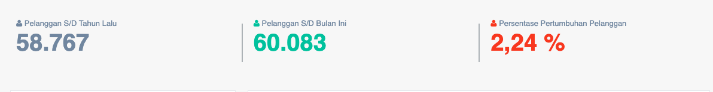
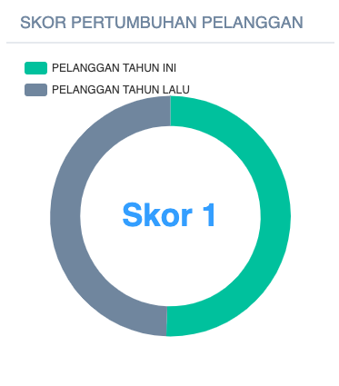

= Menampilkan Data Pertumbuhan Pelanggan

Data pertumbuhan pelanggan PDAM dapat ditampilkan dengan dengan mengakses fitur *Pertumbuhan Pelanggan* pada _dropdown menu_ *Kinerja Pelayanan* yang termasuk dalam Aspek Pelayanan. Data ini digunakan untuk mengetahui besarnya persentase peningkatan jumlah pelanggan PDAM dalam satu tahun. Indikator ini adalah dapat menggambarkan aktivitas PDAM dalam usahanya menambah jumlah pelanggan. Jika cakupan pelayanan diatas 80%, maka pertumbuhan pelanggan dinilai 5. Pertumbuhan Pelanggan Memiliki Bobot 0.05
 
*Pertumbuhan Pelanggan (% Per tahun) = ( ( Jumlah Pelanggan Tahun ini - Pelanggan Tahun lalu ) / Jumlah Pelanggan Tahun lalu ) * 100%*

|===
^.^h|    *Standar*    ^.^h| *Nilai* 
|     >= 10%    |   5   
| 8 -< 10 (10%) |   4   
|   6 -< 8 (%)  |   3   
|   4 -< 6 (%)  |   2   
|    < 4 (%)    |   1   
|===

