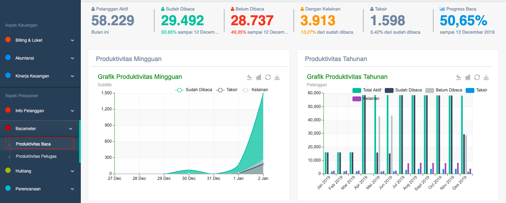
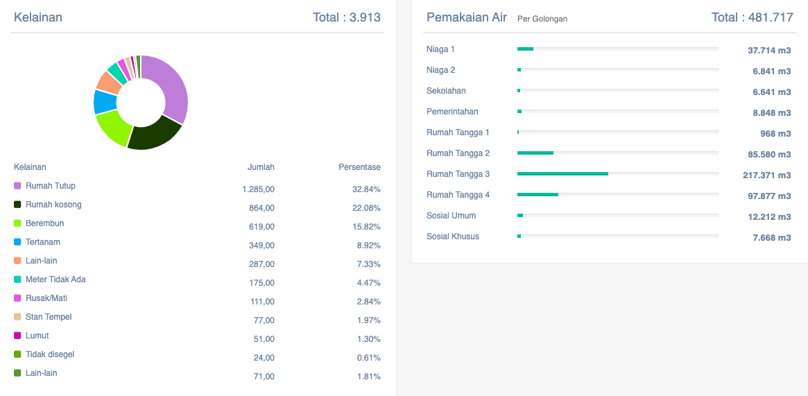

= Menampilkan Data Produktivitas Baca

Data tingkat produktivitas baca dapat ditampilkan dengan dengan mengakses fitur *Produktivitas Baca* pada _dropdown menu_ *Bacameter* yang termasuk dalam Aspek Pelayanan. Data yang ditampilkan mencakup data pelanggan aktif, status baca (sudah/belum), dengan kelainan, taksir, dan progress baca. Berikut adalah tampilan fitur produktivitas baca.

[loweralpha]
. *Kelainan* adalah kerusakan yang terjadi pada water meter pelanggan PDAM
. *Taksir* adalah hitungan kira-kira yang diambil dari presentase sudah dibaca
. *Progress baca* adalah hitungan presentase baca yang masih dalam proses

Seperti yang bisa dilihat melalui gambar di atas, fitur produktivitas baca akan menampilkan data sesuai dengan periode mingguan dan tahunan.  Kemudian lebih didetailkan untuk mendapatkan data spesifik kelainan dan pemakaian air seperti di bawah ini.

