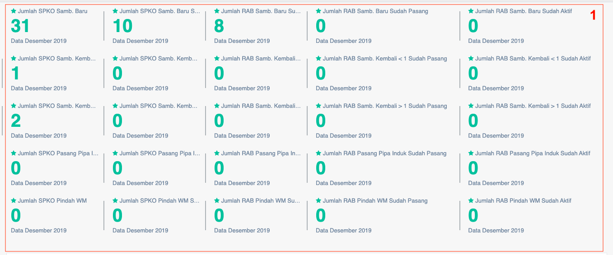
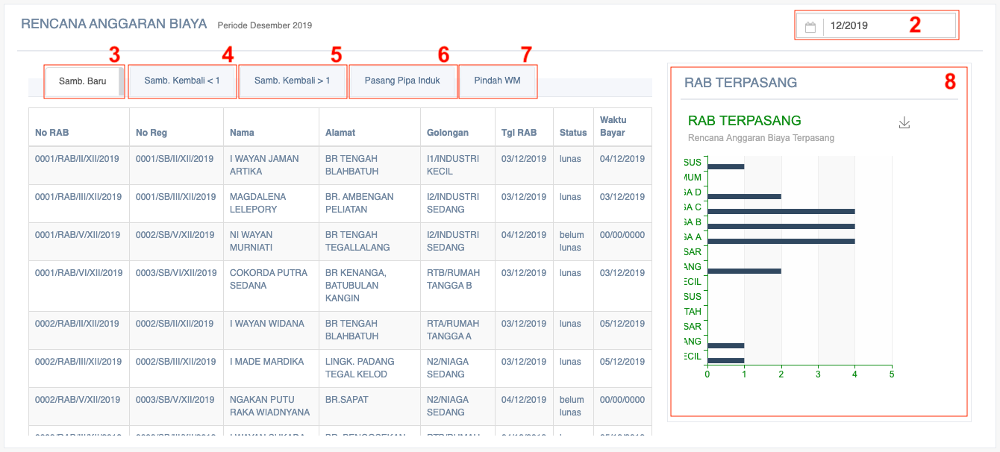

= Menampilkan Data RAB dan Realisasinya

Data RAB dan realisasinya dapat ditampilkan dengan dengan mengakses fitur *RAB dan Realisasi* pada _dropdown menu_ *Perencanaan* yang termasuk dalam Aspek Pelayanan. Data yang ditampilkan dikategorikan berdasarkan jenis SPKO sambungan, pasang pipa induk, dan pindah WM (baru/kembali/sudah pasang/sudah aktif. Berikut adalah tampilan halaman RAB dan Realisasi.

Kemudian, juga ditampilkan tabel Rencana *Anggaran Biaya* yang dipilih berdasarkan periode bulanan. Adapun informasi yang disajikan berupa no *RAB, no Reg, nama, alamat, golongan, tanggal RAB, status,* dan *waktu bayar* seperti yang bisa dilihat di bawah ini.

