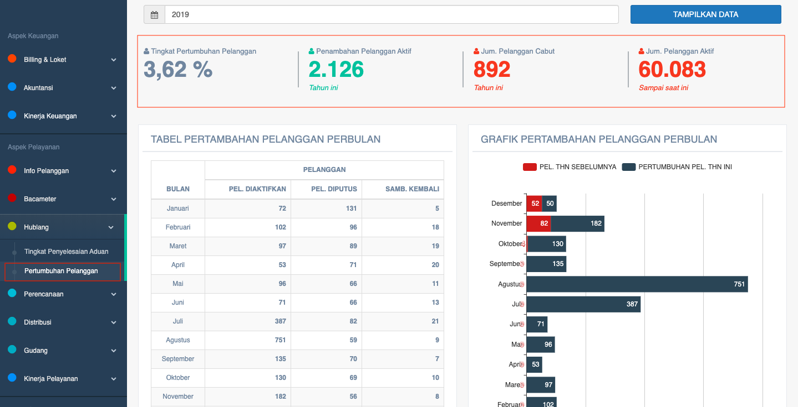

= Menampilkan Data Tahunan Pertumbuhan Pelanggan

Data tahunan pertumbuhan pelanggan dapat ditampilkan dengan dengan mengakses fitur *Pertumbuhan Pelanggan* pada _dropdown menu_ *Hublang* yang termasuk dalam Aspek Pelayanan. Data yang ditampilkan mencakup *persentase tingkat pertumbuhan pelanggan*, *penambahan pelanggan aktif* dan jumlah pelanggan aktif dalam satu tahun. Selain data tersebut, data pertambahan pelanggan juga didetailkan dalam tabel dan grafik per bulannya.

