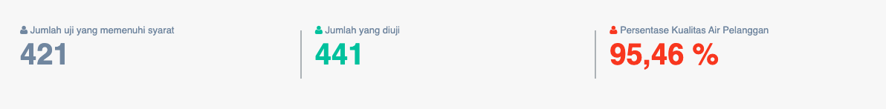
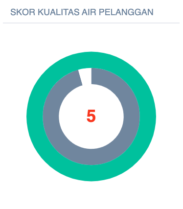

= Menampilkan Data Tingkat Kualitas Air PDAM

Data tingkat kualitas air PDAM dapat ditampilkan dengan dengan mengakses fitur *Kualitas Air PDAM* pada _dropdown menu_ *Kinerja Pelayanan* yang termasuk dalam Aspek Pelayanan. Data yang ditampilkan akan digunakan sebagai indikator untuk mengetahui apakah kualitas air yang didistribusikan oleh PDAM kepada pelanggan telah memenuhi kualitas air minum seperti yang ditetapkan dalam Permenkes. 

Indikator ini akan menggambarkan sejauh mana PDAM mampu melayani pelanggannya dengan kualitas pelayanan air minum (3K) sebagaimana yang diatur dalam Peraturan Menteri Kesehatan No. 492/MENKES/PER/IV/2010, tentang Persyaratan Kualitas Air Minum. Kualitas air pelanggan Memiliki Bobot 0.075.

*Kualitas air pelanggan (% Per tahun) = ( Jumlah uji yang memenuhi syarat / Jumlah yang diuji ) x 100%*

*Standar Penilaian Kualitas Air Pelanggan*

|===
^.^h|    *Standar*    ^.^h| *Nilai* 
|     >= 80%    |   5   
| 60 - < 80 (%) |   4   
| 40 - < 60 (%) |   3   
| 20 - < 40 (%) |   2   
|    < 20 (%)   |   1  
|=== 

