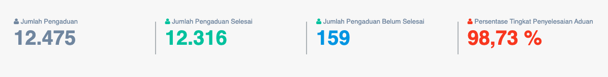
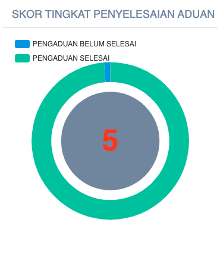

= Menampilkan Data Tingkat Penyelesaian Aduan Pelanggan

Data tingkat penyelesaian aduan pelanggan dapat ditampilkan dengan dengan mengakses fitur *Tingkat Penyelesaian Aduan* pada _dropdown menu_ *Kinerja Pelayanan* yang termasuk dalam Aspek Pelayanan. Data yang ditampilkan akan digunakan sebagai indikator untuk menilai kualitas pelayanan yang diberikan oleh PDAM yaitu dengan cara mengetahui sejauh mana PDAM mampu menangani keluhan pelanggan dalam satu tahun. 

Indikator ini menggambarkan tingkat aktivitas manajemen PDAM dalam upaya menyelesaikan masalah keluhan pelayanan air maupun lainnya yang berasal dari pelanggan dan atau bukan pelanggan. Pertumbuhan Pelanggan Memiliki Bobot 0.025.

*Tingkat Penyelesaian Aduan (% Per tahun) = ( Jumlah Keluhan Selesai / Jumlah Keluhan ) * 100%*

*Standar Penilaian Kinerja Tingkat Penyelesaian Aduan*

|===
^.^h|    *Standar*    ^.^h| *Nilai* 
|     >= 80%    |   5   
| 60 - < 80 (%) |   4   
| 40 - < 60 (%) |   3   
| 20 - < 40 (%) |   2   
|    < 20 (%)   |   1  
|=== 

