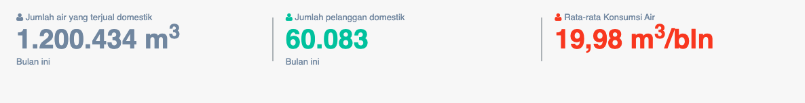
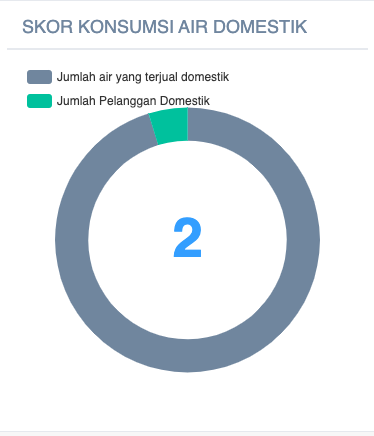

= Menampilkan Data dan Skor Konsumsi Air Secara Domestik

Data dan skor konsumsi air domestik dapat ditampilkan dengan dengan mengakses fitur *Konsumsi Air Domestik* pada _dropdown menu_ *Kinerja Pelayanan* yang termasuk dalam Aspek Pelayanan. Data yang ditampilkan menggambarkan tingkat rata-rata konsumsi air per pelanggan rumah tangga dalam satu bulan dalam tahun yang bersangkutan. Untuk lebih jauh, dapat pula diketahui rata-rata konsumsi liter per orang per harinya. 

Hal ini penting mengingat pendekatan konsumsi minimal (Basic Needs Approach/BNA) dengan membandingkan capaian PDAM terhadap BNA, maka terukurlah posisi capaian yang telah dilakukan PDAM terhadap pelanggannya. Cakupan Pelayanan Teknis Memiliki Bobot 0.05.

*Konsumsi Air Domestik = Jumlah air yang terjual domestik / Jumlah pelanggan domestik*

*Standar Penilaian Konsumsi Air Domestik*

|===
^.^h|         *Standar*         ^.^h| *Nilai* 
|       > 30 m3/bln       |   5   
| 25 m3/bln - < 30 m3/bln |   4   
| 20 m3/bln - < 25 m3/bln |   3   
| 15 m3/bln - < 20 m3/bln |   2   
|       < 15 m3/bln       |   1   
|===

