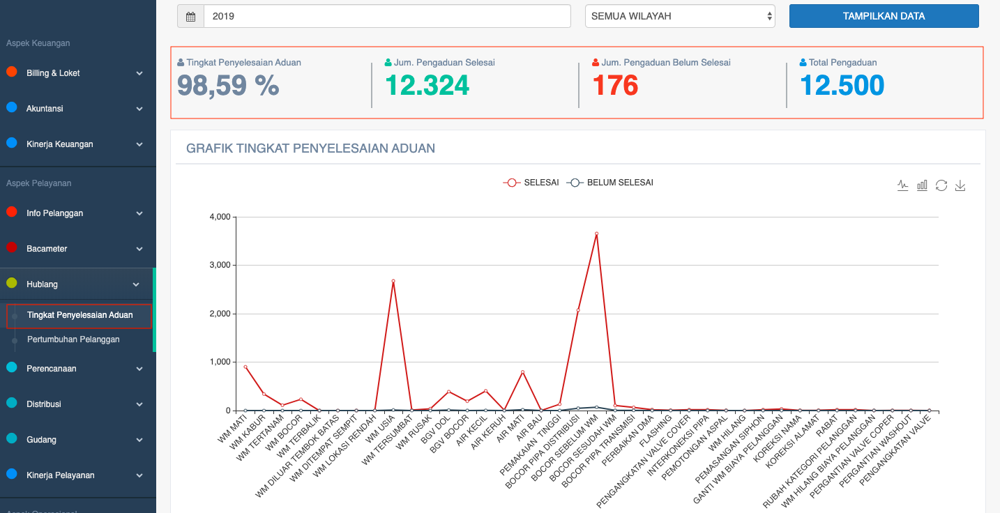

= Menampilkan Detail Data Pengaduan Pelanggan

Informasi tagihan pelanggan dapat ditampilkan dengan dengan mengakses fitur *Tingkat Penyelesaian Aduan* pada _dropdown menu_ *Hublang* yang termasuk dalam Aspek Pelayanan. Data akan ditampilkan berdasarkan jumlah pengaduan (selesai/belum selesai) dan jenis pengaduan. Selain ditampilkan dalam bentuk tabel, tingkat penyelesaian aduan juga digambarkan dalam grafik seperti di bawah ini. 

Seperti yang bisa dilihat melalui gambar di atas, beberapa jenis pengaduan yang sering dilaporkan antara lain:

. Water meter mati, kabur, tertanam, terbalik, di luar tembok batas, di tempat sempit, lokasi rendah, usia, tersumbat, rusak
. BGV dol, bocor
. Air kecil, keruh, mati, bau
. Pemakaian tinggi
. Bocor pipa distribusi, sebelum WM, sesudah WM, pipa transmisi
. _Flashing_, dll