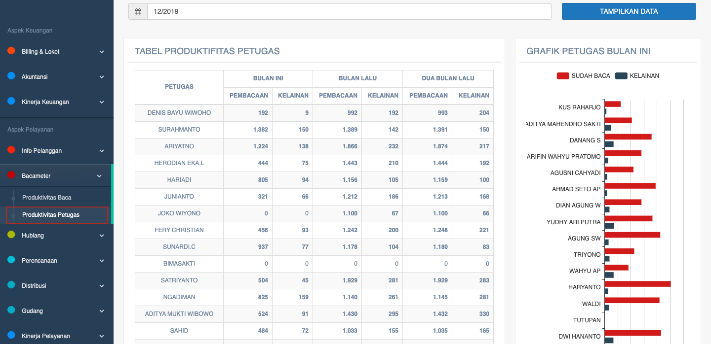

= Menampilkan Detail Data Produktivitas Petugas Baca

Data produktivitas petugas bacameter dapat ditampilkan dengan dengan mengakses fitur *Produktivitas Petugas* pada _dropdown menu_ *Bacameter* yang termasuk dalam Aspek Pelayanan. Data ditampilkan dalam tabel yang mencakup *Nama Petugas*, *Pembacaan*, dan *Kelainan* (bulan ini, bulan lalu, dan 2 bulan lalu).  Selain itu, ditampilkan juga grafik yang berisi perbandingan pembacaan meter pelanggan dan kelainan yang didapatkan masing-masing petugas.

Berikut adalah tampilan halaman produktivitas petugas.

