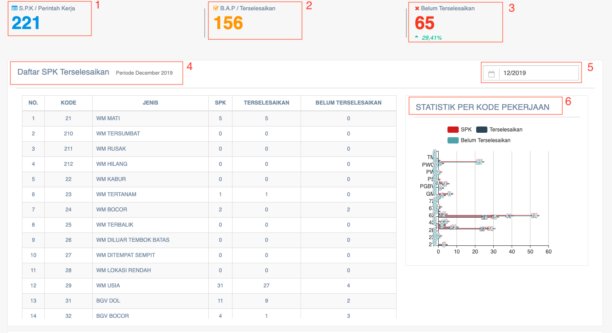
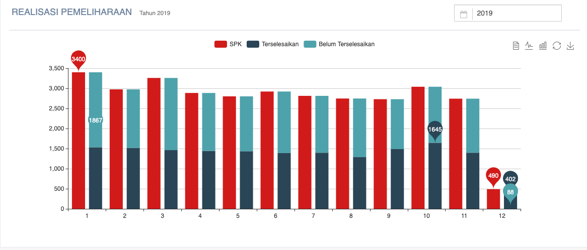

= Menampilkan Laporan SPK dan BAP Pemeliharaan Sambungan Baru

Laporan SPK dan BAP pemeliharaan sambungan baru dapat ditampilkan dengan dengan mengakses fitur *SPK & BAP Pemeliharaan* pada _dropdown menu_ *Distribusi* yang termasuk dalam Aspek Pelayanan. Konsep dari fitur SPK & BAP Pemeliharaan sekilas mirip dengan sambungan baru. Jika fitur SPK & BAP sambungan baru ditujukan untuk semua atribut terpasang, lain halnya dengan SPK & BAP pemeliharaan yang hanya ditujukan untuk pergantian water meter. Adapun tampilan fiturnya bisa dilihat seperti gambar di bawah ini.

Setelah melihat tabel berisi daftar SPK terselesaikan, berikutnya fitur ini juga akan menampilkan gambar diagram batang berisi data realisasi pemeliharaan sesuai dengan tahun yang dipilih. 

1. Kolom *Range Tahun* digunakan untuk memilih data rentang waktu (periode tahun) dari data yang akan ditampilkan
2. Ikon *Text* digunakan untuk menampilkan data realisasi pemeliharaan dalam bentuk tabel informasi berisi teks
3. Ikon *Line* digunakan untuk menampilkan data realisasi pemeliharaan dalam bentuk tabel informasi berisi diagram garis
4. Ikon *Bar* data realisasi pemeliharaan dalam bentuk tabel informasi berisi diagram batang
5. Ikon *Restore* digunakan untuk mengembalikan grafik realisasi pemeliharaan seperti sebelumnya
6. Ikon *Save* digunakan untuk menyimpan data realisasi pemeliharaan  yang telah dimasukkan ke dalam sistem